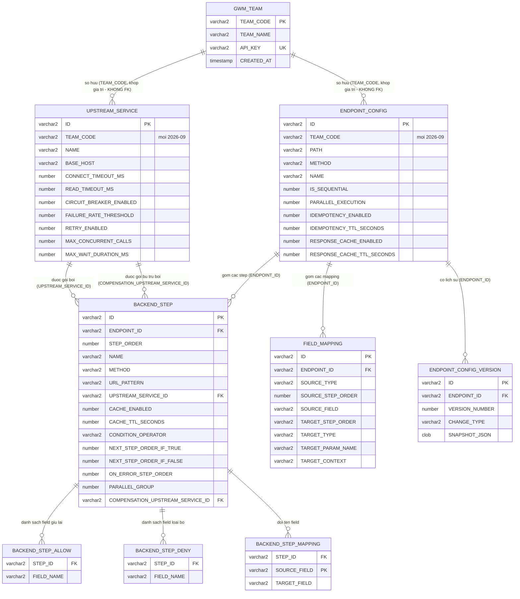

# DATABASE DESIGN DOCUMENT (DBDD)
# Hệ thống Gateway Manager (BCCS Composite API Gateway)

| | |
|---|---|
| **Mã tài liệu** | DBDD-GWM-001 |
| **Phiên bản** | 1.0 |
| **Ngày phát hành** | 2026-09-06 |
| **Trạng thái** | Draft |
| **Hệ quản trị CSDL** | Oracle (tương thích 19c trở lên) |
| **Công cụ quản lý schema** | DDL bàn giao cho DBA từng đội tự chạy (`backend/src/main/resources/db/team-schema/`) — KHÔNG dùng Flyway/công cụ tự động |
| **Tài liệu liên quan** | FDS-GWM-001 (mục 3), SAD-GWM-001 (ADR-03) |

---

## 1. Lịch sử thay đổi tài liệu

| Phiên bản | Ngày | Người soạn | Mô tả |
|---|---|---|---|
| 1.0 | 2026-09-06 | Đội phát triển Gateway Manager | Khởi tạo, mô tả đúng schema baseline V1 |
| 1.1 | 2026-09-08 | Đội phát triển Gateway Manager | Bỏ Flyway — chuyển sang bàn giao DDL cho DBA từng đội tự chạy (xem SAD-GWM-001 ADR-03) |
| 2.0 | 2026-09-09 | Đội phát triển Gateway Manager | DB chuyển sang dùng CHUNG mọi đội (trước: mỗi đội 1 DB riêng) — thêm cột `TEAM_CODE` + bảng `GWM_TEAM` mới (`V2__team_code.sql`), đổi 2 ràng buộc UNIQUE thành ghép `TEAM_CODE`, cập nhật ERD/mục 5/mục 7 (xem SAD-GWM-001 ADR-07) |

---

## 2. Giới thiệu

Tài liệu mô tả chi tiết thiết kế cơ sở dữ liệu (CSDL) của hệ thống: sơ đồ
quan hệ thực thể (ERD), đặc tả từng bảng (cột, kiểu dữ liệu, khoá, ràng
buộc), chỉ mục (index), và khẳng định rõ về View/Stored Procedure. Nguồn sự
thật của schema là `V1__baseline.sql` (baseline) + `V2__team_code.sql` (thêm
`TEAM_CODE`/`GWM_TEAM`, 2026-09) + các file `V3__...sql` kế tiếp (nếu có),
đặt trong `backend/src/main/resources/db/team-schema/` — **không** còn dùng
Hibernate `ddl-auto=update` để tự sinh/sửa schema (xem ADR-03, SAD-GWM-001).

**Quy ước đặt tên**: tên bảng/cột dùng `SNAKE_CASE` viết hoa (chuẩn Oracle
truyền thống); khoá chính mọi bảng là `VARCHAR2(255)` chứa UUID sinh phía
ứng dụng (không dùng `SEQUENCE`/`IDENTITY` của Oracle).

---

## 3. Sơ đồ quan hệ thực thể (ERD)

**TỪ 2026-09 (xem `SAD-Gateway-Manager.md` ADR-07): DB dùng CHUNG cho MỌI đội**
(khác trước — mỗi đội 1 DB riêng hoàn toàn). Cách ly dữ liệu giữa các đội qua
cột `TEAM_CODE` mới trên `UPSTREAM_SERVICE`/`ENDPOINT_CONFIG` + bảng
`GWM_TEAM` mới (danh sách đội, không có FK — `TEAM_CODE` chỉ là 1 chuỗi khớp
theo giá trị, KHÔNG ràng buộc khoá ngoại DB, để tránh phải sửa DDL của 6 bảng
hiện có).

---

## 4. Đặc tả chi tiết từng bảng

### 4.0. `GWM_TEAM` (mới, 2026-09)

Danh sách đội BCCS đang dùng chung Control Plane — CRUD qua `TeamController`,
CHỈ gọi được bằng **platform-admin key** (`GATEWAY_ADMIN_API_KEY`).

| Cột | Kiểu dữ liệu | Null? | Khoá/Ràng buộc | Mô tả |
|---|---|---|---|---|
| TEAM_CODE | VARCHAR2(50 CHAR) | NOT NULL | PK (`GWM_TEAM_PK`) | Do đội nền tảng tự đặt lúc tạo (vd `VCOM`) — KHÔNG tự sinh UUID, cần dễ nhớ/tra cứu |
| TEAM_NAME | VARCHAR2(255 CHAR) | NOT NULL | | Tên hiển thị |
| API_KEY | VARCHAR2(255 CHAR) | NOT NULL | UNIQUE (`GWM_TEAM_API_KEY_UK`) | Sinh ngẫu nhiên 256-bit lúc tạo đội, dùng cho cả CRUD của đội LẪN đồng bộ Data Plane → Control Plane. Lưu **plaintext** (giới hạn đã biết — xem SAD ADR-07) |
| CREATED_AT | TIMESTAMP(6) WITH TIME ZONE | NULL | | |

### 4.1. `UPSTREAM_SERVICE`

| Cột | Kiểu dữ liệu | Null? | Khoá/Ràng buộc | Mô tả |
|---|---|---|---|---|
| ID | VARCHAR2(255 CHAR) | NOT NULL | PK (`UPSTREAM_SERVICE_PK`) | UUID |
| TEAM_CODE | VARCHAR2(50 CHAR) | NOT NULL | Thêm 2026-09 qua `V2__team_code.sql` | Đội sở hữu — KHÔNG có FK tới `GWM_TEAM` (khớp theo giá trị, xem đầu mục 3) |
| NAME | VARCHAR2(255 CHAR) | NOT NULL | UNIQUE ghép với TEAM_CODE (`UPSTREAM_SERVICE_TEAM_NAME_UK`, thay thế `UKR9K2UNQ519ISGPHWC5EMCHYUC` cũ) | Tên hiển thị, duy nhất TRONG 1 đội — 2 đội khác nhau ĐƯỢC PHÉP trùng tên (khác hành vi trước 2026-09) |
| BASE_HOST | VARCHAR2(255 CHAR) | NOT NULL | | vd `http://10.x.x.x:8045` |
| DESCRIPTION | VARCHAR2(255 CHAR) | NULL | | |
| CONNECT_TIMEOUT_MS | NUMBER(10,0) | NOT NULL | | |
| READ_TIMEOUT_MS | NUMBER(10,0) | NOT NULL | | |
| CIRCUIT_BREAKER_ENABLED | NUMBER(1,0) | NOT NULL | CHECK IN (0,1) | |
| FAILURE_RATE_THRESHOLD | NUMBER(10,0) | NOT NULL | | % |
| RETRY_ENABLED | NUMBER(1,0) | NOT NULL | CHECK IN (0,1) | |
| MAX_CONCURRENT_CALLS | NUMBER(10,0) | NOT NULL | DEFAULT 20 | Bulkhead |
| MAX_WAIT_DURATION_MS | NUMBER(10,0) | NOT NULL | DEFAULT 500 | Bulkhead |
| CREATED_AT | TIMESTAMP(6) WITH TIME ZONE | NULL | | |
| UPDATED_AT | TIMESTAMP(6) WITH TIME ZONE | NULL | | |

### 4.2. `ENDPOINT_CONFIG`

| Cột | Kiểu dữ liệu | Null? | Khoá/Ràng buộc | Mô tả |
|---|---|---|---|---|
| ID | VARCHAR2(255 CHAR) | NOT NULL | PK (`ENDPOINT_CONFIG_PK`) | UUID |
| TEAM_CODE | VARCHAR2(50 CHAR) | NOT NULL | Thêm 2026-09 qua `V2__team_code.sql` | Đội sở hữu — KHÔNG có FK tới `GWM_TEAM` |
| PATH | VARCHAR2(255 CHAR) | NOT NULL | UNIQUE ghép với TEAM_CODE (`ENDPOINT_CONFIG_TEAM_PATH_UK`, thay thế `UK5SBR9SP37R2WRGTA6BTBEE3XB` cũ) | vd `/v1/orders/{orderId}` — duy nhất TRONG 1 đội, 2 đội được phép trùng path |
| METHOD | VARCHAR2(255 CHAR) | NOT NULL | CHECK IN (GET,POST,PUT,DELETE,PATCH) | |
| NAME | VARCHAR2(255 CHAR) | NOT NULL | | |
| DESCRIPTION | VARCHAR2(255 CHAR) | NULL | | |
| OUTPUT_ENCODING | VARCHAR2(255 CHAR) | NULL | mặc định ứng dụng `json` | |
| IS_SEQUENTIAL | NUMBER(1,0) | NOT NULL | CHECK IN (0,1) | |
| PARALLEL_EXECUTION | NUMBER(1,0) | NOT NULL | DEFAULT 0, CHECK IN (0,1) | Chỉ có ý nghĩa khi IS_SEQUENTIAL=0 |
| IDEMPOTENCY_ENABLED | NUMBER(1,0) | NOT NULL | DEFAULT 0, CHECK IN (0,1) | |
| IDEMPOTENCY_TTL_SECONDS | NUMBER(10,0) | NOT NULL | DEFAULT 86400 | |
| RESPONSE_CACHE_ENABLED | NUMBER(1,0) | NOT NULL | DEFAULT 0, CHECK IN (0,1) | |
| RESPONSE_CACHE_TTL_SECONDS | NUMBER(10,0) | NOT NULL | DEFAULT 300 | |
| CREATED_AT | TIMESTAMP(6) WITH TIME ZONE | NULL | | |
| UPDATED_AT | TIMESTAMP(6) WITH TIME ZONE | NULL | | |

### 4.3. `BACKEND_STEP`

| Cột | Kiểu dữ liệu | Null? | Khoá/Ràng buộc | Mô tả |
|---|---|---|---|---|
| ID | VARCHAR2(255 CHAR) | NOT NULL | PK (`BACKEND_STEP_PK`) | |
| ENDPOINT_ID | VARCHAR2(255 CHAR) | NULL | FK → ENDPOINT_CONFIG.ID (`FKRTN26VYRBRFLYH5FA838XWTL2`) | |
| STEP_ORDER | NUMBER(10,0) | NOT NULL | | Duy nhất trong phạm vi 1 Endpoint (ràng buộc mức ứng dụng, không phải UNIQUE composite DB) |
| NAME | VARCHAR2(255 CHAR) | NOT NULL | | |
| METHOD | VARCHAR2(255 CHAR) | NOT NULL | CHECK IN (GET,POST,PUT,DELETE,PATCH) | |
| URL_PATTERN | VARCHAR2(255 CHAR) | NOT NULL | | Có thể chứa `{token}` |
| UPSTREAM_SERVICE_ID | VARCHAR2(255 CHAR) | NOT NULL | FK → UPSTREAM_SERVICE.ID (`FK2RCXPBA4YOIDGMRN8I0S3OFTT`) | |
| FORWARD_ORIGINAL_BODY | NUMBER(1,0) | NOT NULL | CHECK IN (0,1) | |
| CACHE_ENABLED | NUMBER(1,0) | NOT NULL | DEFAULT 0, CHECK IN (0,1) | **Xem lưu ý §4.6** |
| CACHE_TTL_SECONDS | NUMBER(10,0) | NOT NULL | DEFAULT 300 | |
| GROUP_NAME | VARCHAR2(255 CHAR) | NULL | | |
| TARGET_FIELD | VARCHAR2(255 CHAR) | NULL | | |
| CANVAS_X, CANVAS_Y | NUMBER(10,0) | NULL | | Vị trí hiển thị canvas |
| CONDITION_SOURCE_TYPE | VARCHAR2(255 CHAR) | NULL | CHECK IN (STEP_RESPONSE, REQUEST_BODY, STEP_RESPONSE_ARRAY_AGGREGATE) | |
| CONDITION_SOURCE_FIELD | VARCHAR2(255 CHAR) | NULL | | |
| CONDITION_SOURCE_STEP_ORDER | NUMBER(10,0) | NULL | | |
| CONDITION_OPERATOR | VARCHAR2(255 CHAR) | NULL | CHECK IN (EQUALS, NOT_EQUALS, EXISTS, NOT_EXISTS, GREATER_THAN, GREATER_THAN_OR_EQUAL, LESS_THAN, LESS_THAN_OR_EQUAL) | |
| CONDITION_EXPECTED_VALUE | VARCHAR2(255 CHAR) | NULL | | |
| NEXT_STEP_ORDER_IF_TRUE, NEXT_STEP_ORDER_IF_FALSE | NUMBER(10,0) | NULL | | |
| ON_ERROR_STEP_ORDER | NUMBER(10,0) | NULL | | |
| PARALLEL_GROUP | NUMBER(10,0) | NULL | | Mã "wave" |
| CONNECT_TIMEOUT_MS, READ_TIMEOUT_MS | NUMBER(10,0) | NULL | | Override riêng, null = dùng của Upstream |
| COMPENSATION_UPSTREAM_SERVICE_ID | VARCHAR2(255 CHAR) | NULL | FK → UPSTREAM_SERVICE.ID (`BACKEND_STEP_COMP_UPSTREAM_FK`) | |
| COMPENSATION_METHOD | VARCHAR2(255 CHAR) | NULL | CHECK IN (GET,POST,PUT,DELETE,PATCH) | |
| COMPENSATION_URL_PATTERN | VARCHAR2(255 CHAR) | NULL | | |

**Bảng con** (cùng khoá cha `STEP_ID` → `BACKEND_STEP.ID`):

| Bảng | Cột | Mô tả |
|---|---|---|
| `BACKEND_STEP_ALLOW` | STEP_ID (FK), FIELD_NAME | Danh sách field GIỮ LẠI trong response step |
| `BACKEND_STEP_DENY` | STEP_ID (FK), FIELD_NAME | Danh sách field LOẠI BỎ khỏi response step |
| `BACKEND_STEP_MAPPING` | STEP_ID (FK) + SOURCE_FIELD (PK ghép `BACKEND_STEP_MAPPING_PK`), TARGET_FIELD | Đổi tên field: SOURCE_FIELD (tên gốc) → TARGET_FIELD (tên mới) |

### 4.4. `FIELD_MAPPING`

| Cột | Kiểu dữ liệu | Null? | Khoá/Ràng buộc | Mô tả |
|---|---|---|---|---|
| ID | VARCHAR2(255 CHAR) | NOT NULL | PK (`FIELD_MAPPING_PK`) | |
| ENDPOINT_ID | VARCHAR2(255 CHAR) | NULL | FK → ENDPOINT_CONFIG.ID (`FKG9BDKEU7BU7USNQSCONIOKV8K`) | |
| SOURCE_TYPE | VARCHAR2(255 CHAR) | NOT NULL | CHECK (`FIELD_MAPPING_SOURCE_TYPE_CHK`) IN (STEP_RESPONSE, REQUEST_BODY, QUERY_PARAM, STEP_RESPONSE_ARRAY_AGGREGATE, CONSTANT, STEP_RESPONSE_ARRAY_MERGE) | |
| SOURCE_STEP_ORDER | NUMBER(10,0) | NULL | | Dùng với STEP_RESPONSE* |
| SOURCE_FIELD | VARCHAR2(255 CHAR) | NULL | | |
| SOURCE_ARRAY_FIELD | VARCHAR2(255 CHAR) | NULL | | Dùng với ARRAY_AGGREGATE/ARRAY_MERGE |
| SOURCE_ELEMENT_FIELD | VARCHAR2(255 CHAR) | NULL | | Dùng với ARRAY_AGGREGATE |
| CONSTANT_VALUE | VARCHAR2(4000 CHAR) | NULL | | Dùng với CONSTANT — length 4000 CỐ Ý lớn hơn quy ước 255 chung (xem §4.6) |
| TARGET_STEP_ORDER | NUMBER(10,0) | NOT NULL | | |
| TARGET_TYPE | VARCHAR2(255 CHAR) | NOT NULL | CHECK IN (PATH, QUERY, HEADER, BODY_FIELD) | |
| TARGET_PARAM_NAME | VARCHAR2(255 CHAR) | NOT NULL | | |
| MAPPING_ORDER | NUMBER(10,0) | NOT NULL | DEFAULT 0 | |
| TARGET_CONTEXT | VARCHAR2(255 CHAR) | NOT NULL | DEFAULT 'MAIN', CHECK (`FIELD_MAPPING_TARGET_CONTEXT_CHK`) IN (MAIN, COMPENSATION) | |

### 4.5. `ENDPOINT_CONFIG_VERSION`

| Cột | Kiểu dữ liệu | Null? | Khoá/Ràng buộc | Mô tả |
|---|---|---|---|---|
| ID | VARCHAR2(255 CHAR) | NOT NULL | PK (`ENDPOINT_CONFIG_VERSION_PK`) | |
| ENDPOINT_ID | VARCHAR2(255 CHAR) | NOT NULL | (không đặt FK CASCADE — xoá theo tay ở tầng ứng dụng trước khi xoá Endpoint) | |
| VERSION_NUMBER | NUMBER(10,0) | NOT NULL | UNIQUE ghép với ENDPOINT_ID (`UK2NPOJ2PDGV4HFROGTJSFCPQXU`) | Tăng dần riêng theo từng Endpoint |
| CHANGE_TYPE | VARCHAR2(255 CHAR) | NOT NULL | CHECK IN (CREATED, UPDATED, ROLLED_BACK) | |
| METHOD, NAME, PATH | VARCHAR2(255 CHAR) | NOT NULL | | Copy nhanh phục vụ hiển thị danh sách, không cần parse JSON |
| SNAPSHOT_JSON | CLOB | NOT NULL | | Toàn bộ nội dung Endpoint (JSON) tại thời điểm lưu |
| CREATED_AT | TIMESTAMP(9) WITH TIME ZONE | NULL | | Độ chính xác nano-giây (cao hơn các bảng khác — phục vụ sắp xếp chính xác khi nhiều version tạo cùng lúc trong test) |

### 4.6. Lưu ý thiết kế quan trọng (bài học thực tế)

- **Không dùng kiểu `BOOLEAN` cho các cột 0/1** (`CACHE_ENABLED`,
  `IS_SEQUENTIAL`, `RESPONSE_CACHE_ENABLED`...) — kiểu `BOOLEAN` với vai trò
  KIỂU CỘT BẢNG chỉ có từ Oracle 23c, sẽ lỗi `ORA-00902` trên Oracle 19c.
  Toàn bộ cột dạng logic đều dùng `NUMBER(1,0)` kèm `CHECK (col IN (0,1))`.
  Ở tầng ứng dụng (Hibernate), bắt buộc cấu hình
  `hibernate.type.preferred_boolean_jdbc_type=INTEGER` để tránh Hibernate tự
  suy luận sang `BOOLEAN` native khi kết nối tới Oracle 23c+ (xem ADR-03,
  SAD-GWM-001) — đã xác nhận thực nghiệm giá trị `NUMERIC` KHÔNG dùng được
  (lỗi khi ghi dữ liệu), phải dùng `INTEGER`.
- **`FIELD_MAPPING.CONSTANT_VALUE` dùng `VARCHAR2(4000)`** thay vì 255 mặc
  định — do giá trị hằng số có thể là 1 đoạn JSON (object/mảng) dài hơn 1
  chuỗi tên field thông thường.
- **Không dùng `SEQUENCE`/`IDENTITY`** cho khoá chính — toàn bộ ID là UUID
  sinh phía ứng dụng Java trước khi ghi xuống DB, tránh phụ thuộc round-trip
  lấy giá trị sinh tự động của Oracle.
- **`TEAM_CODE` trên `UPSTREAM_SERVICE`/`ENDPOINT_CONFIG` KHÔNG có ràng buộc
  FK tới `GWM_TEAM`** (chỉ khớp theo giá trị chuỗi, xác thực ở tầng ứng dụng
  qua `CurrentTeamContext`) — quyết định có chủ đích: thêm FK thật đòi hỏi
  sửa DDL của CẢ 6 bảng hiện có cùng lúc thêm cột mới (rủi ro cao hơn khi bàn
  giao cho DBA chạy 1 lần), trong khi ứng dụng vốn đã validate schema chặt
  qua `hibernate.ddl-auto=validate` + luôn tự stamp `TEAM_CODE` lúc tạo (không
  bao giờ để trống/sai) — rủi ro dữ liệu mồ côi coi như bằng 0 trong thực tế
  vận hành.

---

## 5. Chỉ mục (Indexing)

| Bảng | Chỉ mục | Loại | Mục đích |
|---|---|---|---|
| GWM_TEAM | `GWM_TEAM_API_KEY_UK` (API_KEY) | Unique index (tự động) | `ApiKeyAuthFilter` tra cứu đội theo key trên MỌI request `/api/**` (trừ `/api/teams/**`) — mục đích chính của chỉ mục này |
| UPSTREAM_SERVICE | `UPSTREAM_SERVICE_TEAM_NAME_UK` (TEAM_CODE, NAME) | Unique index (tự động, thay thế `UKR9K2UNQ519ISGPHWC5EMCHYUC` cũ) | Tra theo tên khi CRUD, TRONG phạm vi 1 đội |
| ENDPOINT_CONFIG | `ENDPOINT_CONFIG_TEAM_PATH_UK` (TEAM_CODE, PATH) | Unique index (tự động, thay thế `UK5SBR9SP37R2WRGTA6BTBEE3XB` cũ) | Đảm bảo không trùng đường dẫn TRONG 1 đội — cũng phục vụ mọi câu truy vấn CRUD của Control Plane (luôn lọc theo `TEAM_CODE` trước, xem `CurrentTeamContext`) |
| ENDPOINT_CONFIG_VERSION | `UK2NPOJ2PDGV4HFROGTJSFCPQXU` (ENDPOINT_ID, VERSION_NUMBER) | Unique index (tự động) | Đảm bảo không trùng số phiên bản trong 1 Endpoint |
| ENDPOINT_CONFIG_VERSION | `IDX_ECV_ENDPOINT_ID` (ENDPOINT_ID) | Non-unique index (tạo riêng) | Tăng tốc truy vấn "lấy tất cả phiên bản của 1 Endpoint" |
| BACKEND_STEP | (không có index riêng ngoài PK/FK tự động) | | FK tới ENDPOINT_ID/UPSTREAM_SERVICE_ID được Oracle tự tạo index hỗ trợ ràng buộc |
| FIELD_MAPPING | (không có index riêng ngoài PK/FK tự động) | | |

**Ghi chú thiết kế**: hệ thống có lưu lượng ĐỌC cấu hình rất thấp so với lưu
lượng traffic thật (Data Plane từ 2026-09 đọc từ bộ nhớ đệm nạp qua HTTP,
KHÔNG còn truy vấn DB trực tiếp nữa — xem SAD ADR-07; chỉ Control Plane còn
đọc DB, cho tần suất CRUD/UI thấp) — vì vậy KHÔNG cần thêm chỉ mục tối ưu đọc
phức tạp ngoài các chỉ mục tự động theo PK/FK/UNIQUE ở trên (2 UNIQUE index
ghép `TEAM_CODE` ở trên vừa đảm bảo ràng buộc vừa đủ dùng làm chỉ mục lọc
theo đội). Nếu về sau bổ sung tính năng tìm kiếm cấu hình theo nhiều điều
kiện phức tạp (full-text trên `NAME`/`DESCRIPTION`...), cần đánh giá lại.

---

## 6. View & Stored Procedure

**Hệ thống hiện KHÔNG sử dụng View hay Stored Procedure/Function nào ở tầng
cơ sở dữ liệu.** Toàn bộ logic truy vấn/tổng hợp dữ liệu (lọc, join, gộp)
nằm ở **tầng ứng dụng** qua Spring Data JPA (`Repository`) và các lớp
`*Mapper`/`*Service` trong mã nguồn Java — đây là lựa chọn thiết kế có chủ
đích, không phải thiếu sót:

- Giữ toàn bộ logic nghiệp vụ trong 1 nơi (mã nguồn Java, có thể unit test,
  version control cùng ứng dụng) thay vì phân tán sang cả PL/SQL.
- Tránh phụ thuộc tính năng PL/SQL đặc thù Oracle, giữ khả năng tương thích
  ngược qua nhiều phiên bản Oracle (bao gồm 19c) đơn giản hơn.
- Khối lượng dữ liệu cấu hình (không phải dữ liệu giao dịch lớn) không đòi
  hỏi tối ưu hoá ở tầng CSDL bằng View/Procedure.

Nếu trong tương lai cần báo cáo/thống kê phức tạp trực tiếp trên CSDL (ví dụ
dashboard tổng hợp qua BI tool truy vấn thẳng Oracle), có thể bổ sung View
CHỈ ĐỌC (không ảnh hưởng luồng ghi của ứng dụng) như 1 hạng mục riêng, bàn
giao qua đúng quy trình DDL ở mục 7.

---

## 7. Chiến lược quản lý thay đổi Schema (Migration Strategy)

**Không dùng công cụ tự động (Flyway/Liquibase/`ddl-auto`) để tạo/sửa schema.**
Lý do: Oracle 19c trung tâm là hạ tầng do DBA quản trị — user chạy Control
Plane chỉ được cấp quyền DML, không có quyền DDL (xem SAD-GWM-001 ADR-03).
Quy trình thay đổi schema:

- Mọi thay đổi cấu trúc bảng (thêm cột, đổi kiểu, thêm ràng buộc) được đóng
  gói thành 1 file DDL thuần mới (`V2__...sql`, `V3__...sql`...), đặt cùng
  `backend/src/main/resources/db/team-schema/` cạnh `V1__baseline.sql`, tên
  file mô tả rõ nội dung, đánh số tăng dần để DBA áp dụng đúng thứ tự.
- **TỪ 2026-09 (xem SAD ADR-07): file DDL bàn giao cho DBA của ĐỘI NỀN TẢNG**
  (đội vận hành Control Plane trung tâm) — KHÔNG còn bàn giao cho DBA của
  từng đội BCCS như trước (khi mỗi đội có DB riêng). `V2__team_code.sql`
  (thêm cột `TEAM_CODE` + bảng `GWM_TEAM` + đổi 2 ràng buộc UNIQUE, xem mục 3)
  là ví dụ migration đầu tiên theo mô hình mới này — chạy 1 lần trên Oracle
  trung tâm, ảnh hưởng CẢ hệ thống (mọi đội), không phải riêng 1 đội.
- KHÔNG sửa lại nội dung 1 file DDL ĐÃ bàn giao — nếu cần sửa nội dung đã sai,
  phát hành 1 file mới (`V(n+1)__...sql`) để chỉnh lại, không ghi đè lịch sử.
- `hibernate.ddl-auto=validate` (CHỈ chạy ở Control Plane — Data Plane không
  kết nối Oracle từ 2026-09, xem SAD ADR-07) đóng vai trò lưới an toàn duy
  nhất ở phía ứng dụng — nếu entity Java và schema thật lệch nhau, Control
  Plane sẽ KHÔNG khởi động được, buộc phát hiện ngay thay vì chạy sai âm thầm.
- Với instance Control Plane mới (chỉ dựng 1 lần duy nhất, không lặp lại theo
  đội): DBA đội nền tảng chạy tuần tự `V1__baseline.sql` rồi `V2__team_code.sql`
  (và mọi `Vn__...sql` tiếp theo) trước khi khởi động lần đầu.

---

## 8. Phụ lục

### 8.1. Bảng tổng hợp toàn bộ ràng buộc CHECK

| Bảng.Cột | Giá trị hợp lệ |
|---|---|
| ENDPOINT_CONFIG.METHOD, BACKEND_STEP.METHOD, BACKEND_STEP.COMPENSATION_METHOD, ENDPOINT_CONFIG_VERSION.METHOD | GET, POST, PUT, DELETE, PATCH |
| BACKEND_STEP.CONDITION_OPERATOR | EQUALS, NOT_EQUALS, EXISTS, NOT_EXISTS, GREATER_THAN, GREATER_THAN_OR_EQUAL, LESS_THAN, LESS_THAN_OR_EQUAL |
| BACKEND_STEP.CONDITION_SOURCE_TYPE | STEP_RESPONSE, REQUEST_BODY, STEP_RESPONSE_ARRAY_AGGREGATE |
| FIELD_MAPPING.SOURCE_TYPE | STEP_RESPONSE, REQUEST_BODY, QUERY_PARAM, STEP_RESPONSE_ARRAY_AGGREGATE, CONSTANT, STEP_RESPONSE_ARRAY_MERGE |
| FIELD_MAPPING.TARGET_TYPE | PATH, QUERY, HEADER, BODY_FIELD |
| FIELD_MAPPING.TARGET_CONTEXT | MAIN, COMPENSATION |
| ENDPOINT_CONFIG_VERSION.CHANGE_TYPE | CREATED, UPDATED, ROLLED_BACK |
| Mọi cột logic 0/1 (CIRCUIT_BREAKER_ENABLED, RETRY_ENABLED, IS_SEQUENTIAL, PARALLEL_EXECUTION, IDEMPOTENCY_ENABLED, RESPONSE_CACHE_ENABLED, FORWARD_ORIGINAL_BODY, CACHE_ENABLED) | 0, 1 |

### 8.2. Tài liệu liên quan

FDS-GWM-001 (mục 3, 10.1), SAD-GWM-001 (ADR-03, mục 6).
