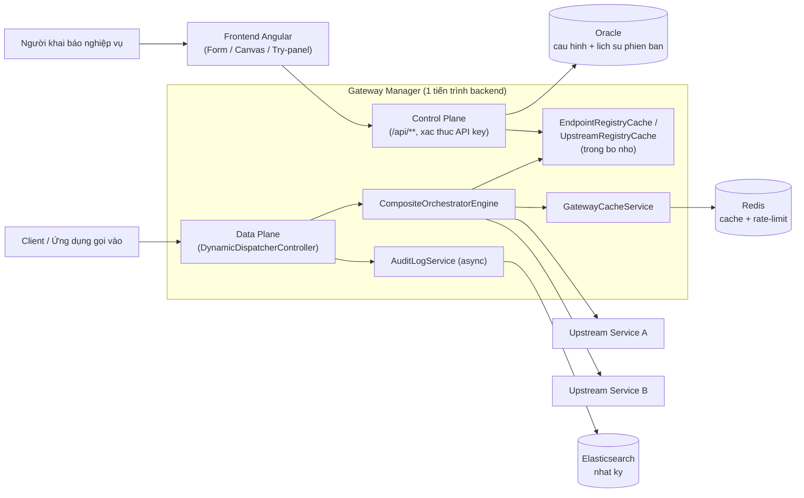
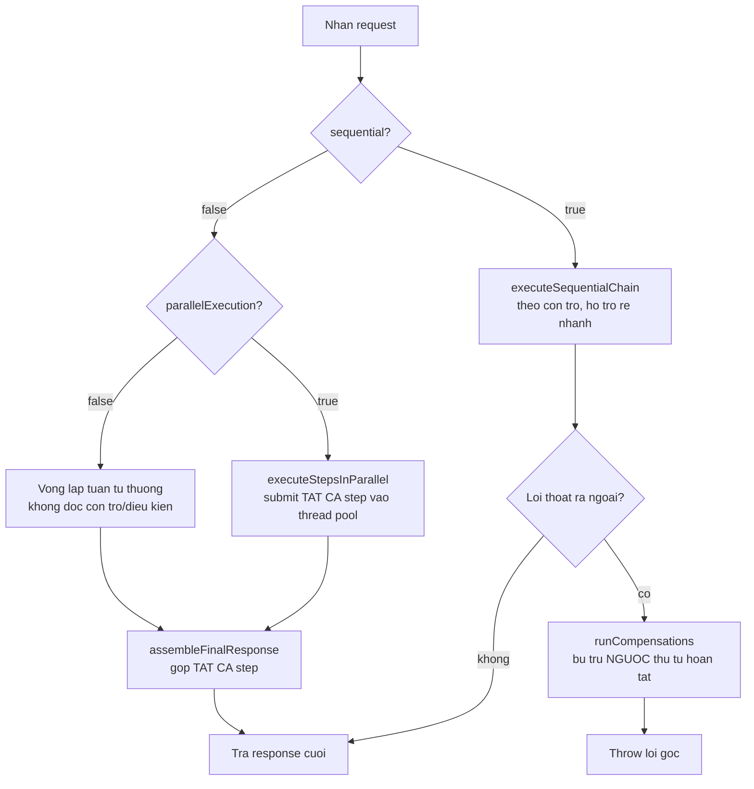

# FUNCTIONAL DESIGN SPECIFICATION (FDS)
# Hệ thống Gateway Manager (BCCS Composite API Gateway)

| | |
|---|---|
| **Mã tài liệu** | FDS-GWM-001 |
| **Phiên bản** | 1.0 |
| **Ngày phát hành** | 2026-09-06 |
| **Trạng thái** | Draft |
| **Tài liệu gốc** | SRS-GWM-001 |
| **Đối tượng đọc** | Lập trình viên, Kiến trúc sư hệ thống |

---

## 1. Giới thiệu

Tài liệu này mô tả **thiết kế kỹ thuật cụ thể** hiện thực hoá các yêu cầu
trong SRS-GWM-001: kiến trúc, mô hình dữ liệu, danh sách API, thuật toán của
engine điều phối, và các cơ chế cache/resilience/audit. Đây là tài liệu tham
chiếu chính khi phát triển/bảo trì hệ thống.

---

## 2. Kiến trúc tổng thể

### 2.1. Ngăn xếp công nghệ (Technology Stack)

| Lớp | Công nghệ |
|---|---|
| Backend | Spring Boot 4.0.8, Java 25 (JDK 25), Maven |
| Frontend | Angular 18, TypeScript, Angular Material |
| Cơ sở dữ liệu | Oracle (JDBC `ojdbc11`), schema do DBA từng đội tự tạo qua DDL bàn giao (không tự động) |
| Cache/Rate-limit | Redis (qua `StringRedisTemplate`) |
| Nhật ký | Elasticsearch (client Java chính thức) |
| Giám sát | Elastic APM Java Agent |
| Khả năng chịu lỗi | Resilience4j (circuit breaker, retry, bulkhead) |
| Đóng gói triển khai | Docker + Docker Compose |

### 2.2. Sơ đồ thành phần



### 2.3. Nguyên tắc kiến trúc

- **Control Plane và Data Plane cùng 1 tiến trình**: thay đổi cấu hình qua
  Control Plane gọi `EndpointRegistryCache.reload()`/`UpstreamRegistryCache`
  ngay lập tức, Data Plane đọc cấu hình từ bộ nhớ đệm trong tiến trình (không
  đọc thẳng cơ sở dữ liệu mỗi request).
- **Không trạng thái chia sẻ giữa các instance**: mỗi instance (mỗi đội triển
  khai) giữ bộ nhớ đệm cấu hình, RestTemplate cache, bộ đếm circuit
  breaker/bulkhead hoàn toàn độc lập trong JVM của chính nó — không đồng bộ
  qua mạng với instance khác.
- **Fail-open cho hạ tầng phụ trợ**: Redis (cache/rate-limit) và
  Elasticsearch (audit) không bao giờ được phép làm chặn/lỗi traffic thật nếu
  bản thân chúng gặp sự cố.
- **Đồng bộ hoàn toàn**: không dùng lập trình reactive/bất đồng bộ ở bất kỳ
  lớp nào (kể cả gọi Upstream Service).

---

## 3. Mô hình dữ liệu

Schema do DBA từng đội tự tạo qua DDL bàn giao (xem mục 10.1), file gốc tại
`backend/src/main/resources/db/team-schema/V1__baseline.sql`. 8 bảng chính:

### 3.1. `UPSTREAM_SERVICE`

| Cột | Kiểu | Ghi chú |
|---|---|---|
| ID | VARCHAR2(255) PK | UUID |
| NAME | VARCHAR2(255) UNIQUE | |
| BASE_HOST | VARCHAR2(255) | vd `http://10.x.x.x:8045` |
| CONNECT_TIMEOUT_MS, READ_TIMEOUT_MS | NUMBER(10,0) | |
| CIRCUIT_BREAKER_ENABLED | NUMBER(1,0) | 0/1 |
| FAILURE_RATE_THRESHOLD | NUMBER(10,0) | % lỗi kích hoạt circuit breaker |
| RETRY_ENABLED | NUMBER(1,0) | 0/1 |
| MAX_CONCURRENT_CALLS | NUMBER(10,0) DEFAULT 20 | Bulkhead |
| MAX_WAIT_DURATION_MS | NUMBER(10,0) DEFAULT 500 | Bulkhead |
| CREATED_AT, UPDATED_AT | TIMESTAMP WITH TIME ZONE | |

### 3.2. `ENDPOINT_CONFIG`

| Cột | Kiểu | Ghi chú |
|---|---|---|
| ID | VARCHAR2(255) PK | |
| PATH | VARCHAR2(255) UNIQUE | vd `/v1/orders/{orderId}` |
| METHOD | VARCHAR2(255) CHECK IN (GET,POST,PUT,DELETE,PATCH) | |
| NAME, DESCRIPTION | VARCHAR2(255) | |
| OUTPUT_ENCODING | VARCHAR2(255) | mặc định `json` |
| IS_SEQUENTIAL | NUMBER(1,0) | tuần tự hay không |
| PARALLEL_EXECUTION | NUMBER(1,0) DEFAULT 0 | chỉ có ý nghĩa khi IS_SEQUENTIAL=0 |
| IDEMPOTENCY_ENABLED | NUMBER(1,0) DEFAULT 0 | |
| IDEMPOTENCY_TTL_SECONDS | NUMBER(10,0) DEFAULT 86400 | |
| RESPONSE_CACHE_ENABLED | NUMBER(1,0) DEFAULT 0 | |
| RESPONSE_CACHE_TTL_SECONDS | NUMBER(10,0) DEFAULT 300 | |

### 3.3. `BACKEND_STEP`

| Cột | Kiểu | Ghi chú |
|---|---|---|
| ID | VARCHAR2(255) PK | |
| ENDPOINT_ID | FK → ENDPOINT_CONFIG | |
| STEP_ORDER | NUMBER(10,0) | duy nhất trong 1 Endpoint |
| NAME, METHOD, URL_PATTERN | | URL_PATTERN có thể chứa `{token}` |
| UPSTREAM_SERVICE_ID | FK → UPSTREAM_SERVICE | |
| FORWARD_ORIGINAL_BODY | NUMBER(1,0) | lấy nguyên body gốc client làm nền |
| CACHE_ENABLED, CACHE_TTL_SECONDS | | cache riêng của step |
| GROUP_NAME | VARCHAR2(255) nullable | dùng khi gộp response nhiều step độc lập |
| TARGET_FIELD | VARCHAR2(255) nullable | field cần "bóc vỏ" response trước khi xử lý tiếp |
| CANVAS_X, CANVAS_Y | NUMBER(10,0) nullable | vị trí hiển thị trên canvas |
| CONDITION_SOURCE_TYPE, CONDITION_SOURCE_FIELD, CONDITION_SOURCE_STEP_ORDER | | nguồn giá trị so sánh rẽ nhánh |
| CONDITION_OPERATOR | CHECK IN (EQUALS, NOT_EQUALS, EXISTS, NOT_EXISTS, GREATER_THAN, GREATER_THAN_OR_EQUAL, LESS_THAN, LESS_THAN_OR_EQUAL) | |
| CONDITION_EXPECTED_VALUE | VARCHAR2(255) | |
| NEXT_STEP_ORDER_IF_TRUE, NEXT_STEP_ORDER_IF_FALSE | NUMBER(10,0) nullable | |
| ON_ERROR_STEP_ORDER | NUMBER(10,0) nullable | fallback khi step lỗi |
| PARALLEL_GROUP | NUMBER(10,0) nullable | mã "wave" song song trong chuỗi tuần tự |
| COMPENSATION_UPSTREAM_SERVICE_ID, COMPENSATION_METHOD, COMPENSATION_URL_PATTERN | | lệnh bù trừ, cả 3 phải cùng có/cùng không |
| CONNECT_TIMEOUT_MS, READ_TIMEOUT_MS | NUMBER(10,0) nullable | override riêng, null = dùng mặc định Upstream |

Bảng con: `BACKEND_STEP_ALLOW`/`BACKEND_STEP_DENY` (danh sách field lọc),
`BACKEND_STEP_MAPPING` (đổi tên field, PK ghép `STEP_ID+SOURCE_FIELD`).

### 3.4. `FIELD_MAPPING`

| Cột | Kiểu | Ghi chú |
|---|---|---|
| ID | VARCHAR2(255) PK | |
| ENDPOINT_ID | FK → ENDPOINT_CONFIG | |
| SOURCE_TYPE | CHECK IN (STEP_RESPONSE, REQUEST_BODY, QUERY_PARAM, STEP_RESPONSE_ARRAY_AGGREGATE, CONSTANT, STEP_RESPONSE_ARRAY_MERGE) | |
| SOURCE_STEP_ORDER, SOURCE_FIELD | nullable | dùng với STEP_RESPONSE |
| SOURCE_ARRAY_FIELD, SOURCE_ELEMENT_FIELD | nullable | dùng với ARRAY_AGGREGATE |
| CONSTANT_VALUE | VARCHAR2(4000) nullable | dùng với CONSTANT |
| TARGET_STEP_ORDER | NUMBER(10,0) | |
| TARGET_TYPE | CHECK IN (PATH, QUERY, HEADER, BODY_FIELD) | |
| TARGET_PARAM_NAME | VARCHAR2(255) | |
| MAPPING_ORDER | NUMBER(10,0) DEFAULT 0 | thứ tự hiển thị |
| TARGET_CONTEXT | CHECK IN (MAIN, COMPENSATION) DEFAULT 'MAIN' | mapping cho lệnh chính hay lệnh bù trừ |

### 3.5. `ENDPOINT_CONFIG_VERSION`

| Cột | Kiểu | Ghi chú |
|---|---|---|
| ID | VARCHAR2(255) PK | |
| ENDPOINT_ID | | |
| VERSION_NUMBER | NUMBER(10,0) | tăng dần riêng theo từng Endpoint (UNIQUE với ENDPOINT_ID) |
| CHANGE_TYPE | CHECK IN (CREATED, UPDATED, ROLLED_BACK) | |
| SNAPSHOT_JSON | CLOB | toàn bộ nội dung Endpoint tại thời điểm lưu (JSON) |
| METHOD, NAME, PATH | | copy nhanh phục vụ hiển thị danh sách, không cần parse JSON |
| CREATED_AT | TIMESTAMP | |

---

## 4. Thiết kế API (Control Plane, `/api/**`)

### 4.1. Upstream Service

| Method | Path | Mô tả |
|---|---|---|
| GET | `/api/upstreams` | Danh sách |
| POST | `/api/upstreams` | Tạo mới |
| PUT | `/api/upstreams/{id}` | Sửa |
| DELETE | `/api/upstreams/{id}` | Xoá (chặn nếu đang được step nào tham chiếu) |
| GET | `/api/upstreams/health` | Sức khoẻ tất cả Upstream (circuit breaker, cache hit rate, bulkhead) |

### 4.2. Endpoint

| Method | Path | Mô tả |
|---|---|---|
| GET | `/api/endpoints` | Danh sách, hỗ trợ tìm kiếm |
| GET | `/api/endpoints/{id}` | Chi tiết 1 endpoint |
| POST | `/api/endpoints` | Tạo mới |
| PUT | `/api/endpoints/{id}` | Sửa |
| DELETE | `/api/endpoints/{id}` | Xoá (xoá kèm lịch sử phiên bản) |
| GET | `/api/endpoints/dependency-graph` | Sơ đồ phụ thuộc giữa các endpoint (endpoint gọi ngược vào endpoint khác qua chính gateway) |
| GET | `/api/endpoints/{id}/versions` | Lịch sử phiên bản |
| GET | `/api/endpoints/{id}/versions/{versionId}` | Chi tiết 1 phiên bản |
| POST | `/api/endpoints/{id}/versions/{versionId}/rollback` | Khôi phục về phiên bản |
| POST | `/api/endpoints/{id}/try` | "Thử ngay" — endpoint ĐÃ LƯU, gọi thật |
| POST | `/api/endpoints/try-adhoc` | "Thử nhanh" — 1 draft CHƯA LƯU, gọi thật, không ghi DB |
| GET | `/api/endpoints/{id}/openapi` | Tự sinh đặc tả OpenAPI |

**Envelope kết quả "Thử ngay"/"Thử nhanh"** (`TryResultDto`, luôn HTTP 200 cho
lỗi xảy ra trong lúc thực thi/validate):
```json
{
  "success": true,
  "result": { "...": "response cuoi cung" },
  "errorCode": null,
  "errorMessage": null,
  "hops": [
    {
      "stepOrder": 1, "stepName": "...", "upstreamName": "...",
      "method": "GET", "resolvedUrl": "...",
      "requestBody": null, "requestBodyTruncated": false,
      "responseStatus": 200, "responseBody": "...", "responseBodyTruncated": false,
      "durationMs": 42, "cacheHit": false, "success": true, "errorMessage": null
    }
  ]
}
```

### 4.3. Config Export/Import & Deploy

| Method | Path | Mô tả |
|---|---|---|
| GET | `/api/config/export` | Xuất toàn bộ cấu hình |
| POST | `/api/config/import` | Nhập cấu hình |
| POST | `/api/config/deploy` | Validate vòng lặp phụ thuộc + reload registry cache |
| GET | `/api/config/gateway-info` | Thông tin gateway (port, host alias) |

### 4.4. Tra cứu Log

| Method | Path | Mô tả |
|---|---|---|
| GET | `/api/logs/requests` | Tìm kiếm request (lọc thời gian/trạng thái/path/nội dung, phân trang) |
| GET | `/api/logs/requests/{requestId}/hops` | Chi tiết từng hop của 1 request |

### 4.5. Data Plane

Không có tiền tố cố định — mọi đường dẫn do người dùng khai báo trong
`EndpointConfig.path` đều được `DynamicDispatcherController` khớp động qua
`PathPatternParser`, ưu tiên khớp CHÍNH XÁC (path tĩnh, tra O(1) qua map),
nếu không khớp mới quét tuần tự các path có tham số `{token}`.

---

## 5. Thiết kế Engine điều phối (`CompositeOrchestratorEngine`)

### 5.1. Luồng tổng quát (`handle()`)



### 5.2. `executeSequentialChain()` — chuỗi tuần tự có rẽ nhánh

- Bắt đầu từ step có `stepOrder` NHỎ NHẤT.
- Sau mỗi step, gọi `determineNextStepOrder()`:
  - Nếu step không khai báo `conditionOperator` và KHÔNG phải đích của bất kỳ
    bước nhảy nào khác → tiếp tục step có `stepOrder` kế tiếp tăng dần (hành
    vi mặc định, tương thích ngược 100% với cấu hình cũ trước khi có tính
    năng rẽ nhánh).
  - Nếu step không khai báo điều kiện nhưng LÀ đích của 1 bước nhảy (rẽ nhánh
    hoặc fallback lỗi) → kết thúc chuỗi tại đây (không tự động chảy tiếp),
    trừ khi bản thân step đó cũng có điều kiện riêng.
  - Nếu step có `conditionOperator` → tính giá trị thực tế, so sánh với
    `conditionExpectedValue`, chọn `nextStepOrderIfTrue`/`nextStepOrderIfFalse`
    (null = kết thúc chuỗi tại đây).
- Nếu step throw lỗi (Upstream lỗi/timeout) và có khai báo `onErrorStepOrder`
  → nhảy sang step đó thay vì raise; nếu không có → raise ra ngoài, kích hoạt
  `runCompensations()`.
- **Wave song song** (`parallelGroup`): khi con trỏ tiến vào 1 step có
  `parallelGroup` khác null, TOÀN BỘ step cùng mã nhóm được submit đồng thời
  vào `parallelStepExecutor`, chuỗi tuần tự CHỜ hết cả wave rồi mới tiếp tục
  theo step kế tiếp SAU wave (không được nhảy trực tiếp vào giữa wave từ bên
  ngoài).

### 5.3. `executeStepsInParallel()` — song song toàn bộ (`parallelExecution=true`)

- Submit TẤT CẢ step vào `parallelStepExecutor` (`ThreadPoolExecutor`
  core=8, max=16, queue=200, `CallerRunsPolicy`) — pool RIÊNG, tách biệt
  hoàn toàn thread pool Tomcat.
- Chờ TẤT CẢ future hoàn tất (không bỏ cuộc sớm khi gặp lỗi đầu tiên).
- Nếu có ≥1 lỗi, throw lỗi ĐẦU TIÊN theo đúng thứ tự khai báo step (không
  phải thứ tự hoàn thành thực tế) — các lỗi khác chỉ log WARN.
- **Lan truyền `MDC["requestId"]` và `TraceCollector`** thủ công sang từng
  worker thread (ThreadLocal không tự kế thừa) — chụp giá trị của thread gọi
  trước khi submit, gán vào từng task, khôi phục giá trị cũ của worker thread
  trong `finally` (tránh rò rỉ context khi thread trong pool được tái sử
  dụng cho task khác sau này).

### 5.4. `assembleFinalResponse()` — gộp kết quả (nhánh không tuần tự)

- Nếu chỉ có 1 step: trả thẳng response của step đó.
- Nếu ≥2 step: tạo 1 `ObjectNode`, với từng step — nếu có khai báo `group`
  thì đặt response của step đó làm 1 field lồng theo tên group; nếu không,
  gộp phẳng field-by-field (step khai báo SAU đè field trùng tên của step
  TRƯỚC).

### 5.5. `resolvePath()` — thay thế token trong URL

Với mỗi `{token}` trong `urlPattern`, thứ tự ưu tiên lấy giá trị:
1. FieldMapping `targetType=PATH` khai báo cho step đó, tên tham số trùng
   `token`.
2. Nếu không có, lấy từ `pathVariables` của chính request client (token
   trùng tên) — cho phép step tái sử dụng trực tiếp path variable của client
   mà không cần khai FieldMapping riêng.

### 5.6. `runCompensations()` — bù trừ nghiệp vụ

- Chỉ kích hoạt khi lỗi THOÁT RA NGOÀI `executeSequentialChain()` (tức
  `onErrorStepOrder`, nếu có, đã có cơ hội xử lý trước — không kích hoạt bù
  trừ nếu fallback lỗi đã xử lý thành công).
- Duyệt `ExecutionContext.completedStepOrders()` (danh sách stepOrder đã
  hoàn tất, theo ĐÚNG thứ tự hoàn thành thực tế, không phải thứ tự khai báo)
  theo chiều NGƯỢC LẠI.
- Với mỗi step có đủ 3 trường bù trừ, gọi `executeCompensationStep()` — dùng
  lại `UpstreamHttpExecutor.call()` (ghi audit hop y hệt lệnh chính, đánh dấu
  tên step bằng tiền tố `[BU TRU]`), KHÔNG unwrap/transform/lưu kết quả (chỉ
  để ghi nhận thành công/thất bại).
- Lỗi của chính lệnh bù trừ được bọc try/catch riêng từng step — không làm
  dừng việc bù trừ các step còn lại, không che lấp lỗi gốc.

---

## 6. Thiết kế Cache (`GatewayCacheService`, `UpstreamHttpExecutor`)

### 6.1. Cache theo từng step

- Điều kiện: `step.cacheEnabled=true` VÀ phương thức là GET hoặc POST (PUT/
  PATCH/DELETE luôn bị bỏ qua dù có cấu hình).
- Khoá: `"gwm:cache:" + upstreamName + ":" + method + ":" + resolvedUrl`
  (+ `":" + sha256Hex(body)` nếu có body, dùng cho POST).
- Ghi (`put`): TTL được jitter ngẫu nhiên ±15% mỗi lần ghi, tránh "cache
  stampede" (nhiều khoá cùng hết hạn đồng loạt).
- Đọc/ghi lỗi (Redis sự cố) → coi như cache-miss/bỏ qua, không throw.

### 6.2. Cache toàn bộ response 1 Endpoint

- Điều kiện: `EndpointConfig.responseCacheEnabled=true`, VALIDATE CHẶN CỨNG
  lúc lưu nếu Endpoint hoặc BẤT KỲ step nào không phải GET/POST.
- Khoá: `"gwm:response-cache:" + endpointId + ":" + path + "?" + query đã sắp
  xếp theo tên` (+ `":" + sha256Hex(body)` nếu có body).
- Kiểm tra khoá này TRƯỚC khi gọi `engine.handle()` — trúng thì trả thẳng,
  không chạm Upstream nào; chỉ ghi cache khi kết quả THÀNH CÔNG.
- Ưu tiên: nếu Endpoint bật CẢ Idempotency-Key và client có gửi header, kiểm
  tra Idempotency-Key TRƯỚC — chỉ rơi xuống kiểm tra response-cache khi
  không dùng được đường Idempotency-Key.

---

## 7. Thiết kế Khả năng chịu lỗi (Resilience4j)

Đăng ký ĐỘNG theo TÊN Upstream Service (tạo lần đầu khi Upstream được gọi,
không phải cấu hình tĩnh lúc khởi động) — `UpstreamHttpExecutor` giữ registry
riêng, `invalidate(name)` được gọi khi Upstream Service bị xoá/đổi cấu hình.

| Cơ chế | Tham số mặc định (khi Upstream chưa có entry riêng) |
|---|---|
| Circuit Breaker | sliding-window=20 (COUNT_BASED), tối thiểu 10 lệnh gọi trước khi tính, ngưỡng lỗi 50%, mở trong 15s, 5 lệnh thử ở trạng thái nửa-mở |
| Retry | tối đa 3 lần, chờ 200ms giữa các lần — KHÔNG retry lỗi HTTP 4xx (rõ ràng là lỗi client/không thể tự khỏi), CHỈ retry lỗi hạ tầng (timeout/connection refused) hoặc 5xx |
| Bulkhead | 20 lệnh đồng thời, chờ tối đa 500ms trước khi từ chối (`BulkheadFullException`) — cấu hình được riêng theo từng Upstream Service |

Thứ tự bọc decorator (theo khuyến nghị Resilience4j): Bulkhead trong cùng →
CircuitBreaker bọc ngoài Bulkhead → Retry bọc ngoài cùng — đảm bảo mỗi lần
retry đều đi qua đúng kiểm tra circuit breaker/bulkhead, không bỏ qua.

`RestTemplate` được cache theo khoá `(upstreamName, connectTimeoutMs,
readTimeoutMs)` — cho phép 1 Backend Step override timeout riêng mà không
ảnh hưởng các step khác dùng chung Upstream nhưng không override.

---

## 8. Thiết kế Audit Log

- `HopAuditEvent` (1 lệnh gọi Upstream) và `RequestAuditEvent` (1 request
  client) được ghi qua `AuditLogService`: `queue.offer(...)` KHÔNG chặn (hàng
  đợi trong bộ nhớ, giới hạn 5000 phần tử, đầy thì bỏ sự kiện mới + log
  WARN), 1 thread nền (`gwm-audit-flush`) `flush()` theo chu kỳ cố định 1
  giây, ghi hàng loạt (bulk) vào Elasticsearch (index `gwm-requests-yyyy.MM.dd`
  / `gwm-hops-yyyy.MM.dd`, tự tạo qua dynamic mapping, không cần bootstrap
  thủ công).
- Liên kết hop ↔ request qua `requestId` (UUID sinh mới mỗi request tại
  `DynamicDispatcherController`, đặt vào MDC trong suốt vòng đời request, kể
  cả lan truyền sang worker thread khi chạy song song).
- Đường đọc (`LogSearchService`) KHÁC triết lý: lỗi Elasticsearch được throw
  rõ ràng (không fail-open) vì bản chất tính năng tra cứu phụ thuộc trực tiếp
  Elasticsearch, không có gì để "bỏ qua".

**Lưu ý riêng cho "Thử nhanh"/"Thử ngay"** (`TraceCollector`): do đường ghi
audit ở trên bất đồng bộ (độ trễ tới ~1-2 giây mới thấy trên Elasticsearch),
KHÔNG phù hợp cho tính năng cần trả kết quả trace NGAY trong cùng 1 response.
`TraceCollector` là 1 `ThreadLocal<List<StepTraceDto>>` độc lập, được
`UpstreamHttpExecutor.call()` ghi thêm (song song, không phụ thuộc đường ghi
Elasticsearch) mỗi khi có `start()` đang hoạt động trên thread hiện tại —
hoàn toàn không dùng tới Elasticsearch, chỉ tồn tại trong bộ nhớ đúng vòng
đời 1 lần gọi "Thử ngay"/"Thử nhanh".

---

## 9. Thiết kế Frontend

| Khu vực | Công nghệ | Ghi chú |
|---|---|---|
| `endpoint-form` | Angular Reactive Forms | Khai báo tuần tự theo biểu mẫu |
| `endpoint-canvas` | Signal + `[(ngModel)]`, CDK Drag-Drop | Kéo-thả trực quan, SVG vẽ đường nối Field Mapping/rẽ nhánh/wave/bù trừ |
| `try-panel` (dùng chung) | Component thuần hiển thị | Dùng lại ở cả trang "Thử ngay" (endpoint đã lưu) và panel "Thử nhanh" trên Canvas (draft chưa lưu) |
| `log-search` | Bảng + waterfall mở rộng | Tra cứu nhật ký |
| `upstream-services`, `endpoint-list`, `endpoint-versions` | CRUD form tiêu chuẩn | |

**Quy ước bắt buộc**: `endpoint-canvas` và `endpoint-form` KHÔNG dùng chung
component — mọi tính năng cấp Endpoint/Step mới phải cập nhật đồng bộ THỦ
CÔNG ở cả 2 nơi (không có cơ chế tự đồng bộ).

---

## 10. Thiết kế Triển khai đa đội (Multi-team Deployment)

### 10.1. Quản lý schema — DBA từng đội tự chạy DDL, ứng dụng chỉ validate

- Ứng dụng **không** có bất kỳ cơ chế tự động tạo/sửa schema nào (đã thử
  Flyway tự `migrate()` lúc khởi động, sau đó BỎ — xem SAD-GWM-001 ADR-03: lý
  do là user chạy ứng dụng trên Oracle 19c thật của các đội BCCS thường CHỈ
  có quyền DML, không có quyền DDL).
- Quy trình: đội phát triển nền tảng bàn giao file DDL thuần
  (`backend/src/main/resources/db/team-schema/V1__baseline.sql` — chỉ 8 bảng,
  không dữ liệu mẫu; các bản nâng cấp sau là `V2__...sql`...) cho DBA của
  từng đội tự rà soát trùng tên bảng (nếu dùng chung schema) + tự chạy theo
  quy trình change-management riêng của họ. Sau đó DBA cấp cho ứng dụng 1
  user RUNTIME chỉ có quyền DML trên đúng 8 bảng này.
- `hibernate.ddl-auto=validate` — ứng dụng khi khởi động CHỈ đối chiếu entity
  ↔ schema thật, KHÔNG tự sửa/tạo gì; nếu thiếu bảng/cột hoặc sai kiểu, ứng
  dụng không khởi động được, kèm thông báo lỗi rõ ràng.
- **Lưu ý kỹ thuật quan trọng** (vẫn giữ nguyên dù đã bỏ Flyway):
  `hibernate.type.preferred_boolean_jdbc_type` PHẢI đặt `INTEGER` (không phải
  `NUMERIC`, dù cả 2 đều pass được `ddl-auto=validate`) — đã xác nhận thực
  nghiệm `NUMERIC` gây lỗi thật khi GHI dữ liệu boolean thật ("Could not
  convert Boolean to BigDecimal"), là giới hạn/lỗi thật của tổ hợp Hibernate
  7.2.24 + Oracle Dialect, không phải lỗi cấu hình.

### 10.2. Tham số hoá theo từng đội

Toàn bộ thông số kết nối hạ tầng (Oracle, Redis, Elasticsearch, APM) đọc qua
biến môi trường (`.env`, xem `.env.example`), không hard-code trong
`docker-compose.yml`. Biến `TEAM_CODE` gắn vào `spring.application.name` và
`ELASTIC_APM_SERVICE_NAME` để phân biệt instance khi nhiều đội cùng feed 1 hệ
thống giám sát chung (nếu có).

### 10.3. Tính độc lập giữa các instance

`EndpointRegistryCache`/`UpstreamRegistryCache`, bộ đếm circuit
breaker/bulkhead, cache `RestTemplate` — tất cả là state THUẦN TRONG-JVM,
không giả định gì về instance khác cùng tồn tại. Nhiều instance độc lập, mỗi
instance trỏ 1 Oracle/Redis/Elasticsearch riêng, hoạt động đúng với 0 thay
đổi kiến trúc.

---

## 11. Hạn chế kỹ thuật & Rủi ro đã biết

| # | Hạn chế | Ghi chú kỹ thuật |
|---|---|---|
| L1 | `parallelExecution=true` không có cơ chế phát hiện tự động step nào phụ thuộc dữ liệu step khác | Nếu 1 step dùng `FieldMapping sourceType=STEP_RESPONSE` trỏ tới 1 step KHÁC trong cùng nhóm song song, kết quả phụ thuộc hoàn toàn vào tốc độ tương đối giữa các thread (race condition thật) — trách nhiệm người cấu hình đảm bảo các step song song thực sự độc lập |
| L2 | Cache toàn bộ response chỉ validate được method (GET/POST) là điều kiện cần, không phải điều kiện đủ | 1 step POST được đánh dấu tra cứu thuần tuý nhưng thực ra có side-effect vẫn có thể lọt qua validate — trách nhiệm người cấu hình xác nhận đúng bản chất nghiệp vụ |
| L3 | Bù trừ (compensation) là best-effort | Không đảm bảo tuyệt đối, không thay thế giao dịch phân tán có commit 2 pha |
| L4 | Chưa test trên Oracle 19c thật | Toàn bộ kiểm thử trong quá trình phát triển chỉ chạy trên Oracle 23c-free; các câu lệnh DDL đã được viết để tương thích 19c (không dùng kiểu `BOOLEAN`/`JSON` chỉ có từ 23c) nhưng khuyến nghị chạy thử thật trên Oracle 19c trước khi giao cho đội đầu tiên sử dụng phiên bản Oracle đó |
| L5 | Xây dựng ảnh Docker cần Internet lúc build | `Dockerfile` tải Elastic APM Agent qua HTTPS tại thời điểm build — môi trường build cách ly mạng cần điều chỉnh |

---

## 12. Phụ lục

### 12.1. Danh sách giá trị Enum

- `GatewayMethod`: GET, POST, PUT, DELETE, PATCH.
- `FieldMappingSourceType`: STEP_RESPONSE, REQUEST_BODY, QUERY_PARAM,
  STEP_RESPONSE_ARRAY_AGGREGATE, CONSTANT, STEP_RESPONSE_ARRAY_MERGE.
- `MappingTargetType`: PATH, QUERY, HEADER, BODY_FIELD.
- `MappingTargetContext`: MAIN, COMPENSATION.
- `ConditionOperator`: EQUALS, NOT_EQUALS, EXISTS, NOT_EXISTS, GREATER_THAN,
  GREATER_THAN_OR_EQUAL, LESS_THAN, LESS_THAN_OR_EQUAL.
- `EndpointChangeType`: CREATED, UPDATED, ROLLED_BACK.

### 12.2. Tài liệu liên quan

- BRD-GWM-001, SRS-GWM-001 (tài liệu gốc).
- `README.md` — mô tả tính năng đầy đủ kèm ví dụ thực tế.
- `LOCAL_SETUP.md` — dựng môi trường phát triển.
- `DEPLOYMENT_GUIDE.md` — hướng dẫn triển khai cho 1 đội BCCS.
