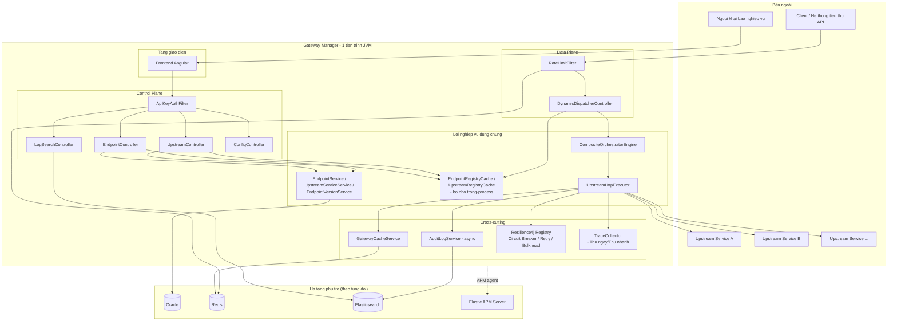
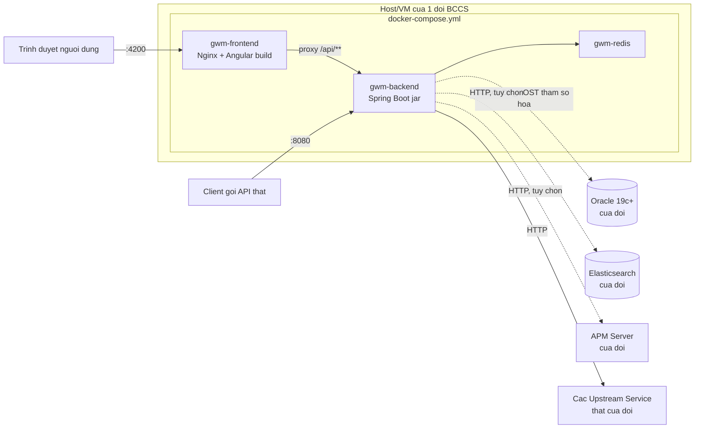
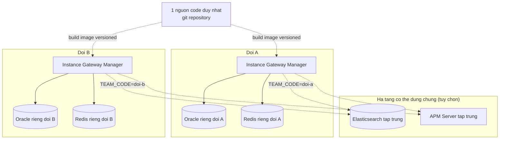
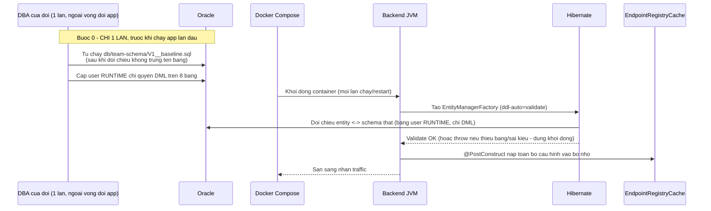
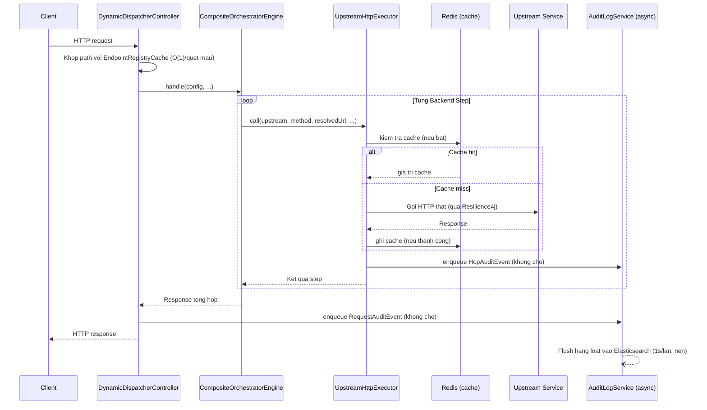

# SYSTEM ARCHITECTURE DOCUMENT (SAD)
# Hệ thống Gateway Manager (BCCS Composite API Gateway)

| | |
|---|---|
| **Mã tài liệu** | SAD-GWM-001 |
| **Phiên bản** | 1.0 |
| **Ngày phát hành** | 2026-09-06 |
| **Trạng thái** | Draft |
| **Tài liệu liên quan** | BRD-GWM-001, SRS-GWM-001, FDS-GWM-001 |
| **Đối tượng đọc** | Kiến trúc sư giải pháp, Trưởng nhóm kỹ thuật, Đội hạ tầng/DevOps |

---

## 1. Lịch sử thay đổi tài liệu

| Phiên bản | Ngày | Người soạn | Mô tả thay đổi |
|---|---|---|---|
| 1.0 | 2026-09-06 | Đội phát triển Gateway Manager | Khởi tạo tài liệu |

---

## 2. Giới thiệu

### 2.1. Mục đích

Tài liệu này mô tả **kiến trúc tổng thể** của hệ thống Gateway Manager ở mức
nhìn toàn cảnh (logic, triển khai, dữ liệu, tích hợp, bảo mật) — khác với
FDS-GWM-001 (đi sâu vào thiết kế chức năng/thuật toán cụ thể), SAD tập trung
vào **các quyết định kiến trúc lớn, ranh giới hệ thống, và cách các thành
phần phối hợp với nhau** — làm cơ sở cho việc đánh giá rủi ro kiến trúc, lập
kế hoạch hạ tầng, và ra quyết định khi mở rộng/thay đổi hệ thống trong tương
lai.

### 2.2. Phạm vi

Bao gồm kiến trúc của **1 instance** Gateway Manager (đơn vị triển khai độc
lập cho 1 đội BCCS) và mô hình **nhiều instance độc lập** khi nhiều đội cùng
sử dụng nền tảng. Không bao gồm kiến trúc nội bộ của các Upstream Service
(backend thật) mà Gateway Manager gọi tới — các hệ thống đó nằm ngoài ranh
giới kiến trúc của tài liệu này.

### 2.3. Định nghĩa kiến trúc & ký hiệu

Sơ đồ trong tài liệu dùng cú pháp Mermaid. Thuật ngữ tham chiếu mục "Thuật
ngữ" của BRD-GWM-001.

---

## 3. Mục tiêu & Ràng buộc kiến trúc (Architecture Drivers)

Kiến trúc được dẫn dắt bởi các yêu cầu phi chức năng (NFR) trong SRS-GWM-001,
tóm tắt lại dưới góc độ quyết định kiến trúc:

| Driver | Yêu cầu gốc | Hệ quả kiến trúc |
|---|---|---|
| Thay đổi cấu hình có hiệu lực ngay | BR-EP-08 | Control Plane và Data Plane PHẢI cùng 1 tiến trình, chia sẻ bộ nhớ đệm cấu hình trong-process |
| Không nghẽn traffic thật khi hạ tầng phụ trợ lỗi | NFR-02 | Mọi tích hợp với Redis/Elasticsearch/APM phải theo nguyên tắc **fail-open** |
| Mỗi đội tự triển khai độc lập trên hạ tầng riêng | BR-DP-01..03 | Không trạng thái chia sẻ GIỮA các instance; đóng gói dưới dạng ảnh container tự chứa |
| Tương thích Oracle phiên bản cũ (19c) | NFR-07 | Không dùng kiểu dữ liệu/tính năng cơ sở dữ liệu chỉ có ở bản mới nhất; quản lý schema qua công cụ migration có kiểm soát phiên bản thay vì để ORM tự suy luận |
| Chi phí nội bộ không đáng kể so với gọi mạng | NFR-01 | Engine điều phối thiết kế nhẹ (thao tác bộ nhớ thuần Java), không thêm tầng trung gian mạng nào giữa việc nhận request và gọi Upstream |
| Không lập trình bất đồng bộ | Ràng buộc nền tảng | Toàn bộ ngăn xếp dùng mô hình đồng bộ (blocking I/O), đánh đổi lấy sự đơn giản/dễ debug, giới hạn thông lượng bởi kích thước thread pool |

---

## 4. Kiến trúc Logic (Logical View)

### 4.1. Sơ đồ thành phần

### 4.2. Trách nhiệm từng thành phần

| Thành phần | Trách nhiệm | Ranh giới KHÔNG đảm nhiệm |
|---|---|---|
| **Control Plane** (`*Controller` dưới `/api/**`) | CRUD cấu hình, tra cứu log, xuất/nhập cấu hình, xem trước | KHÔNG xử lý traffic nghiệp vụ thật của client |
| **Data Plane** (`DynamicDispatcherController`) | Nhận request client, khớp Endpoint, uỷ quyền cho engine, ghi audit | KHÔNG chứa logic điều phối chi tiết (uỷ quyền hết cho `CompositeOrchestratorEngine`) |
| **`CompositeOrchestratorEngine`** | Điều phối thứ tự thực thi step (tuần tự/song song/rẽ nhánh/bù trừ), ánh xạ dữ liệu, gộp response | KHÔNG tự thực hiện lệnh gọi HTTP (uỷ quyền `UpstreamHttpExecutor`) |
| **`UpstreamHttpExecutor`** | Thực hiện 1 lệnh gọi HTTP cụ thể, bọc cache/circuit-breaker/retry/bulkhead/audit cho ĐÚNG lệnh gọi đó | KHÔNG biết gì về thứ tự/logic tổng thể của cả chuỗi Endpoint |
| **`EndpointRegistryCache` / `UpstreamRegistryCache`** | Giữ bản sao cấu hình trong bộ nhớ, phục vụ tra cứu O(1)/gần O(1) cho MỌI request | KHÔNG phải nguồn sự thật (source of truth) — Oracle mới là nguồn thật, registry chỉ là cache đọc |
| **`GatewayCacheService`** | Cache-aside cho kết quả lệnh gọi (theo step hoặc toàn bộ response) | KHÔNG cache cấu hình (đó là việc của Registry Cache) |
| **`AuditLogService`** | Ghi nhật ký bất đồng bộ, fail-open | KHÔNG phục vụ tra cứu (đó là `LogSearchService`, đọc trực tiếp Elasticsearch) |
| **`TraceCollector`** | Thu thập chi tiết từng bước CHO 1 lần "Thử ngay/nhanh" cụ thể, hoàn toàn trong bộ nhớ | KHÔNG liên quan/không phụ thuộc pipeline audit Elasticsearch |
| **Frontend Angular** | Giao diện khai báo (form/canvas), tra cứu, xem trước | KHÔNG chứa logic nghiệp vụ điều phối (chỉ gọi API Control Plane) |

---

## 5. Kiến trúc Triển khai (Deployment View)

### 5.1. Đơn vị triển khai của 1 đội

- **`gwm-frontend`** và **`gwm-backend`** là 2 container sibling trong CÙNG 1
  `docker-compose.yml` — Nginx proxy `/api/**` sang backend qua tên service
  Docker (DNS nội bộ, tự resolve lại định kỳ để chịu được backend restart).
- **`gwm-redis`** đi kèm trong CÙNG file compose — mỗi đội có Redis RIÊNG của
  chính mình (không dùng chung Redis với đội khác hay với nghiệp vụ khác).
- **Oracle/Elasticsearch/APM** KHÔNG phải container trong compose này — kết
  nối ra ngoài qua tham số môi trường (`DB_HOST`, `GATEWAY_AUDIT_ES_HOST`,
  `APM_SERVER_HOST`...), cho phép trỏ tới hạ tầng riêng của từng đội mà không
  cần sửa file cấu hình triển khai.

### 5.2. Mô hình nhiều đội (Multi-tenant về mặt TRIỂN KHAI, không phải Multi-tenant về mặt DỮ LIỆU)

**Nguyên tắc quan trọng**: đây là kiến trúc "mỗi đội 1 instance độc lập hoàn
toàn" (multi-instance), KHÔNG PHẢI kiến trúc multi-tenant kiểu 1 instance
dùng chung phục vụ nhiều đội qua tenant-id. Lý do lựa chọn (xem ADR-04, mục
9): mỗi đội tự chịu tải hạ tầng của chính mình, không có rủi ro 1 đội gây quá
tải ảnh hưởng đội khác, và không cần xây dựng cơ chế cách ly dữ liệu theo
tenant (vốn phức tạp và không cần thiết khi mỗi đội đã có Oracle/Redis
riêng). Elasticsearch/APM là 2 hạ tầng DUY NHẤT có thể dùng chung giữa các
đội (tuỳ chọn) vì bản chất chỉ là nơi TIẾP NHẬN dữ liệu quan sát (observability),
không phải nơi LƯU TRỮ dữ liệu nghiệp vụ — phân biệt bằng `TEAM_CODE` trong
tên service/APM để tách biệt khi xem.

### 5.3. Vòng đời khởi động 1 instance

Việc tạo schema (bước 0 dưới đây) diễn ra **1 lần, TRƯỚC** và **NGOÀI** vòng
đời của ứng dụng, do DBA của đội thực hiện thủ công (xem ADR-03, mục 9) —
ứng dụng không có bất kỳ đường code nào tự tạo/sửa bảng.

---

## 6. Kiến trúc Dữ liệu (Data Architecture)

### 6.1. Phân loại dữ liệu

| Loại dữ liệu | Nơi lưu | Vòng đời |
|---|---|---|
| Cấu hình (Upstream, Endpoint, Step, Mapping) | Oracle | Bền vững, có kiểm soát phiên bản (Flyway cho schema, `EndpointConfigVersion` cho nội dung) |
| Lịch sử phiên bản cấu hình | Oracle (CLOB snapshot JSON) | Bền vững, tăng dần theo thời gian, xoá theo Endpoint khi Endpoint bị xoá |
| Cache kết quả lệnh gọi (theo step / toàn bộ response) | Redis | Tạm thời, tự hết hạn theo TTL (jitter ±15%) |
| Bộ đếm rate-limit | Redis | Tạm thời, tự hết hạn theo window |
| Nhật ký request/hop | Elasticsearch | Bền vững theo chính sách lưu trữ riêng của đội (rolling index theo ngày) |
| Cấu hình đang hoạt động (routing) | Bộ nhớ JVM (`EndpointRegistryCache`) | Tạm thời, tái tạo từ Oracle mỗi khi khởi động hoặc mỗi khi Control Plane thay đổi |
| Chi tiết từng bước của 1 lần "Thử ngay/nhanh" | Bộ nhớ JVM (`ThreadLocal`, `TraceCollector`) | Cực ngắn — chỉ tồn tại trong đúng 1 vòng đời request, không lưu ở đâu khác |

### 6.2. Dòng chảy dữ liệu chính (khi client gọi 1 Endpoint)

Điểm mấu chốt: việc ghi audit (`enqueue`) diễn ra **trước khi trả response**
nhưng KHÔNG chặn — chỉ là thao tác thêm vào hàng đợi trong bộ nhớ, việc ghi
thật vào Elasticsearch xảy ra SAU, trên 1 thread nền riêng, không nằm trên
đường xử lý request của client.

---

## 7. Kiến trúc Tích hợp (Integration Architecture)

| Tích hợp | Giao thức | Kiểu kết nối | Bắt buộc? | Chiến lược khi lỗi |
|---|---|---|---|---|
| Oracle | JDBC (HikariCP pool, tối đa 10 connection) | Đồng bộ | **Bắt buộc** | Hệ thống không khởi động được nếu không kết nối được lúc đầu (Flyway/Hibernate cần schema hợp lệ) |
| Redis | Giao thức Redis (`StringRedisTemplate`, kết nối trễ) | Đồng bộ | Tuỳ chọn về mặt vận hành | Fail-open: cache-miss/bỏ qua rate-limit, request thật vẫn xử lý |
| Elasticsearch | HTTP REST | Đồng bộ (ghi qua hàng đợi + thread nền) | Tuỳ chọn | Fail-open cho GHI (mất log, không chặn); báo lỗi rõ ràng cho ĐỌC (tra cứu) |
| Elastic APM Server | Giao thức APM riêng (qua Java Agent) | Bất đồng bộ (do agent quản lý) | Tuỳ chọn | Agent tự tắt/backoff khi không kết nối được, không ảnh hưởng ứng dụng |
| Upstream Service (bất kỳ) | HTTP/REST | Đồng bộ (`RestTemplate`, timeout theo cấu hình) | Theo từng Endpoint | Circuit breaker/retry/bulkhead theo cấu hình; lỗi trả về client dưới dạng lỗi nghiệp vụ rõ ràng |

**Nguyên tắc tích hợp chung**: hạ tầng nào ảnh hưởng trực tiếp tới TÍNH ĐÚNG
ĐẮN của dữ liệu cấu hình (Oracle) là **bắt buộc**; hạ tầng nào chỉ phục vụ
TỐI ƯU HOÁ hoặc QUAN SÁT (Redis, Elasticsearch, APM) đều **tuỳ chọn và
fail-open** — không đội nào bị chặn triển khai chỉ vì chưa có đủ 3 hạ tầng
phụ trợ đó.

---

## 8. Kiến trúc Bảo mật (Security Architecture)

| Lớp | Cơ chế | Ghi chú |
|---|---|---|
| Control Plane (`/api/**`) | Header khoá API (`X-Gateway-Admin-Key`), so khớp qua `ApiKeyAuthFilter` (Servlet filter, khớp mọi request bắt đầu `/api`) | Giá trị khoá BẮT BUỘC đổi khỏi mặc định khi triển khai thật (`GATEWAY_ADMIN_API_KEY`) |
| Data Plane (client gọi Endpoint) | KHÔNG có cơ chế xác thực tại tầng gateway | Việc xác thực (nếu cần) là trách nhiệm của Endpoint tự chuyển tiếp header xác thực gốc của client sang Upstream Service qua Field Mapping (targetType=HEADER) |
| Đường dẫn dành riêng | Chặn khai báo Endpoint trùng tiền tố `/api` hoặc `/actuator` | Tránh Endpoint composite vô tình bị `ApiKeyAuthFilter` chặn nhầm (filter khớp theo URL pattern Servlet, không phân biệt route Spring MVC nào xử lý) |
| Dữ liệu nhạy cảm trong log | Cắt bớt (truncate) nội dung request/response trước khi ghi audit, đánh dấu rõ khi bị cắt | Giới hạn độ dài, không giới hạn theo field nhạy cảm cụ thể (không có data masking theo tên field) |
| Bí mật cấu hình (mật khẩu DB, khoá API) | Truyền qua biến môi trường (`.env`, không commit vào mã nguồn) | Không có tích hợp vault/secret-manager tập trung ở phiên bản hiện tại |

**Giới hạn đã biết**: hệ thống hiện dùng **1 khoá API dùng chung** cho toàn
bộ Control Plane, không có mô hình người dùng/vai trò/quyền hạn chi tiết
(RBAC) — mọi người có khoá đều có toàn quyền quản trị cấu hình. Đây là giới
hạn kiến trúc đã biết, phù hợp quy mô 1 đội tự quản lý instance của mình,
nhưng cần lưu ý khi mở rộng số người truy cập Control Plane trong 1 đội.

---

## 9. Các Quyết định Kiến trúc Quan trọng (Architecture Decision Records)

### ADR-01: Control Plane và Data Plane chạy chung 1 tiến trình

- **Bối cảnh**: cần cấu hình có hiệu lực ngay lập tức khi lưu, không delay.
- **Quyết định**: gộp Control Plane (CRUD API) và Data Plane (thực thi
  traffic thật) vào CÙNG 1 ứng dụng Spring Boot, chia sẻ bộ nhớ đệm cấu hình
  trong-process (`EndpointRegistryCache`).
- **Đánh đổi**: đơn giản hoá triển khai (1 tiến trình duy nhất), nhưng traffic
  quản trị và traffic nghiệp vụ dùng chung tài nguyên CPU/thread pool của 1
  JVM — không tách được scale riêng cho từng loại traffic.

### ADR-02: Phân phối bằng Docker image versioned, không phải thư viện Maven

- **Bối cảnh**: cần cách để nhiều đội BCCS tự triển khai 1 bản riêng của hệ
  thống hoàn chỉnh (UI + API + schema riêng), không phải 1 lát cắt hạ tầng
  dùng chung kiểu thư viện.
- **Đã cân nhắc**: (a) đóng gói thành thư viện/starter Spring Boot để đội
  khác nhúng vào ứng dụng của họ; (b) copy-fork mã nguồn cho từng đội (theo
  đúng khuôn mẫu `render-template.ps1` sẵn có của nền tảng BCCS cho các
  service khác).
- **Quyết định**: phân phối dưới dạng **ảnh Docker gắn phiên bản** (image
  versioned), build từ 1 nguồn mã DUY NHẤT, mỗi đội `pull` + tự cấu hình
  `.env` trỏ hạ tầng riêng.
- **Lý do loại phương án (a)**: hệ thống là 1 ứng dụng hoàn chỉnh (sở hữu
  schema/API/UI riêng), không phải hạ tầng dùng chung kiểu cache/kết nối HTTP
  — ép thành thư viện đòi hỏi tách toàn bộ tầng persistence/controller ra
  khỏi 1 ứng dụng liền khối, khối lượng refactor lớn, chưa có tiền lệ nào
  tương tự trong nền tảng BCCS.
- **Lý do loại phương án (b)**: copy-fork không có kênh nhận cập nhật/bản vá
  sau này — mã nguồn sẽ phân mảnh dần theo thời gian giữa các đội.

### ADR-03: Bỏ `hibernate.ddl-auto=update`; schema do DBA từng đội tự tạo qua DDL bàn giao — KHÔNG để ứng dụng tự động tạo/sửa schema (đã sửa lại 1 lần)

- **Bối cảnh**: cần đảm bảo schema hoạt động đúng trên Oracle phiên bản cũ
  hơn (19c) mà nhiều đội BCCS đang dùng, trong khi môi trường phát triển nội
  bộ chỉ có Oracle 23c.
- **Quyết định lần đầu (đã thay thế)**: chuyển sang Flyway (SQL migration
  viết tay, tự động `migrate()` khi ứng dụng khởi động) + `ddl-auto=validate`.
- **Phát hiện quan trọng trong quá trình xác minh quyết định lần đầu**:
  `ddl-auto=update` (cách cũ hơn nữa) từng khiến Hibernate tự sinh SAI kiểu
  cột `BOOLEAN` (chỉ có từ Oracle 23c) cho 1 số cột thêm sau — đã phải sửa tay
  các cột này về đúng `NUMBER(1,0)` trên dữ liệu thật, và xác nhận
  `hibernate.type.preferred_boolean_jdbc_type=INTEGER` (không phải `NUMERIC`)
  là giá trị đúng để vừa đối chiếu (validate) đúng vừa đọc/ghi dữ liệu boolean
  chính xác — **kết luận này vẫn giữ nguyên, không đổi** ở quyết định sửa lại
  dưới đây.
- **Lý do sửa lại quyết định Flyway-tự-migrate**: Oracle 19c thật của từng đội
  BCCS không phải schema trống tự do — là **hạ tầng đã vận hành từ trước, do
  DBA quản trị tập trung**. User cấp cho ứng dụng chạy THƯỜNG CHỈ có quyền DML
  (SELECT/INSERT/UPDATE/DELETE), KHÔNG có quyền DDL (`CREATE TABLE`) — giả
  định "Flyway tự `migrate()` lúc khởi động" không đúng với thực tế cấp quyền
  của các hạ tầng Oracle governed này, đồng thời nhiều schema là schema DÙNG
  CHUNG với hệ thống khác của chính đội đó (rủi ro trùng tên bảng nếu không
  rà soát trước khi tạo).
- **Quyết định sau cùng**: bỏ hẳn Flyway khỏi ứng dụng (gỡ dependency +
  `FlywayConfig`). Ứng dụng CHỈ còn `hibernate.ddl-auto=validate` — đối chiếu
  entity với schema thật lúc khởi động, không bao giờ tự tạo/sửa gì. Việc TẠO
  SCHEMA tách hẳn ra khỏi vòng đời ứng dụng: đội phát triển nền tảng bàn giao
  file DDL thuần (`db/team-schema/V1__baseline.sql`, các bản nâng cấp sau này
  là `V2__...sql`...) cho **DBA của từng đội tự rà soát trùng tên bảng + tự
  chạy** theo đúng quy trình change-management nội bộ của họ, sau đó mới cấp
  cho ứng dụng 1 user RUNTIME chỉ có quyền DML. Xem quy trình đầy đủ trong
  `DEPLOYMENT_GUIDE.md` mục 2.
- **Bài học rút ra**: khi thiết kế cho nhiều đội tự triển khai trên hạ tầng
  RIÊNG của họ, không nên mặc định hạ tầng đó "sạch/tự do toàn quyền" như môi
  trường phát triển nội bộ — cần hỏi rõ mô hình cấp quyền/quản trị hạ tầng
  thật của bên tiếp nhận trước khi chọn cơ chế tự động hoá.

### ADR-04: Mô hình nhiều instance độc lập, không phải multi-tenant dùng chung

- **Bối cảnh**: mỗi đội BCCS có Oracle/Redis/Elasticsearch RIÊNG.
- **Quyết định**: mỗi đội chạy 1 instance hoàn toàn độc lập (dữ liệu, cache,
  registry trong bộ nhớ) — không xây dựng cơ chế phân biệt tenant-id trong 1
  instance dùng chung.
- **Lý do**: hạ tầng đã sẵn tách biệt theo đội, xây multi-tenancy (cách ly dữ
  liệu theo tenant trong CÙNG 1 schema/Redis) sẽ là công sức thừa không giải
  quyết thêm vấn đề gì, đồng thời tăng rủi ro rò rỉ dữ liệu chéo giữa các đội
  nếu cách ly tenant có sai sót.

### ADR-05: Nguyên tắc "fail-open" cho mọi hạ tầng phụ trợ

- **Bối cảnh**: cache (Redis), audit (Elasticsearch), giám sát (APM) không
  phải hạ tầng mọi đội đều có sẵn ngay từ đầu.
- **Quyết định**: mọi lỗi từ 3 hệ thống này chỉ được log cảnh báo, KHÔNG được
  ném lỗi ra ảnh hưởng luồng xử lý request thật.
- **Đánh đổi**: chấp nhận MẤT một phần dữ liệu quan sát (cache-miss nhiều
  hơn, thiếu vài dòng log) khi hạ tầng phụ trợ chập chờn, đổi lấy việc traffic
  nghiệp vụ không bao giờ bị ảnh hưởng bởi sự cố của hạ tầng không thiết yếu.

### ADR-06: Chặn cứng (không chỉ cảnh báo) đối với cache toàn bộ response trên endpoint không phải GET/POST

- **Bối cảnh**: cache toàn bộ response dùng CHUNG cho MỌI client — nếu áp
  dụng nhầm cho 1 lệnh có side-effect thật, 2 client khác nhau có thể nhận
  nhầm kết quả hành động của nhau.
- **Quyết định**: validate CHẶN CỨNG lúc lưu cấu hình (không cho lưu) nếu
  Endpoint hoặc bất kỳ step nào không phải GET/POST, thay vì chỉ cảnh báo
  mềm như 1 số tính năng rủi ro khác (ví dụ `parallelExecution`).
- **Lý do phân biệt mức độ cứng/mềm**: rủi ro của tính năng này (rò rỉ dữ
  liệu CHÉO giữa các client không liên quan) nghiêm trọng và khó phát hiện
  hơn hẳn rủi ro của `parallelExecution` (chỉ ảnh hưởng NỘI BỘ 1 giao dịch
  của đúng 1 client đang gọi).

---

## 10. Rủi ro kiến trúc & Nợ kỹ thuật (Architecture Risks & Technical Debt)

| # | Rủi ro/Nợ kỹ thuật | Ảnh hưởng | Đề xuất theo dõi |
|---|---|---|---|
| AR-1 | Không tách được scale Control Plane và Data Plane (ADR-01) | 1 đợt quản trị nhiều (import cấu hình lớn) có thể ảnh hưởng độ trễ traffic thật cùng lúc | Theo dõi nếu tần suất thao tác Control Plane tăng cao, cân nhắc tách tiến trình trong tương lai |
| AR-2 | Không có RBAC cho Control Plane (mục 8) | Mọi người có khoá API đều có toàn quyền | Chấp nhận được ở quy mô 1 đội tự quản lý; cần đánh giá lại nếu 1 instance được nhiều đội con cùng truy cập |
| AR-3 | Chưa kiểm thử trên Oracle 19c thật (chỉ 23c-free) | Rủi ro phát sinh khác biệt hành vi khi triển khai thật lần đầu | Khuyến nghị kiểm thử thật trên Oracle 19c trước khi giao cho đội đầu tiên dùng phiên bản đó |
| AR-4 | Mô hình đồng bộ hoàn toàn giới hạn thông lượng bởi kích thước thread pool (Tomcat + `parallelStepExecutor`) | Không tận dụng được I/O bất đồng bộ khi số lượng Upstream Service/độ trễ mạng lớn | Chấp nhận có chủ đích (ràng buộc nền tảng "không lập trình reactive") — nếu cần thông lượng cao hơn, cần đánh giá lại ràng buộc này ở tầm nền tảng, không chỉ riêng hệ thống này |
| AR-5 | Bù trừ nghiệp vụ (compensation) là best-effort, không đảm bảo tuyệt đối | Dữ liệu có thể không nhất quán nếu chính lệnh bù trừ cũng thất bại | Ghi nhận đầy đủ lỗi bù trừ để xử lý thủ công; không dùng cho nghiệp vụ bắt buộc toàn vẹn tuyệt đối (xem thêm BRD mục 11) |

---

## 11. Phụ lục

### 11.1. Tài liệu liên quan

- BRD-GWM-001 — Yêu cầu nghiệp vụ.
- SRS-GWM-001 — Yêu cầu hệ thống chi tiết.
- FDS-GWM-001 — Thiết kế chức năng/thuật toán chi tiết.
- `README.md`, `LOCAL_SETUP.md`, `DEPLOYMENT_GUIDE.md` — tài liệu vận hành.

### 11.2. Bảng viết tắt

| Viết tắt | Ý nghĩa |
|---|---|
| SAD | System Architecture Document |
| ADR | Architecture Decision Record |
| TTL | Time To Live |
| RBAC | Role-Based Access Control |
