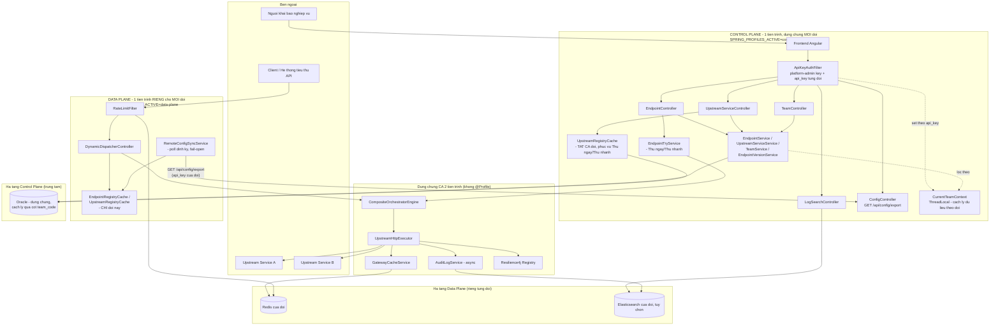
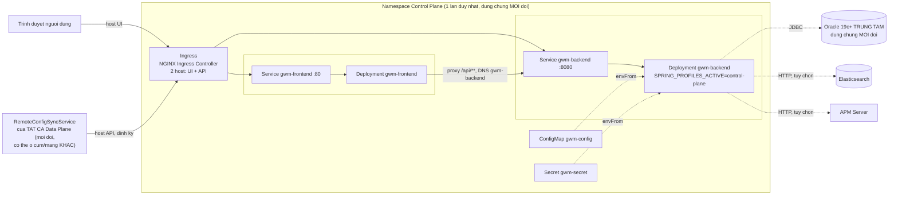
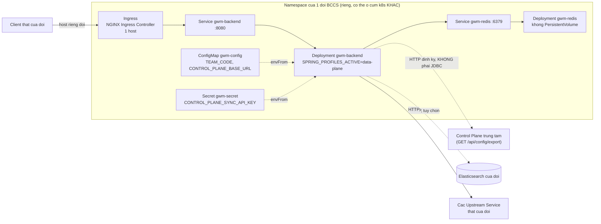
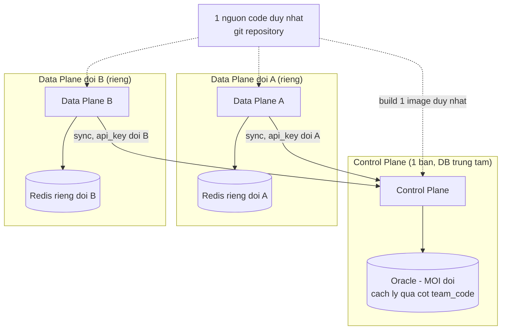
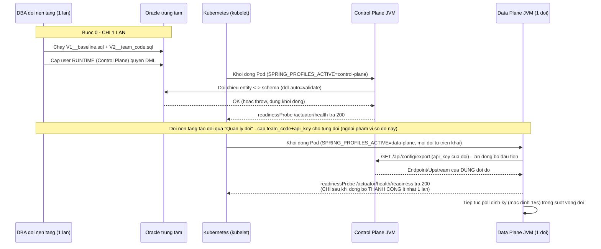
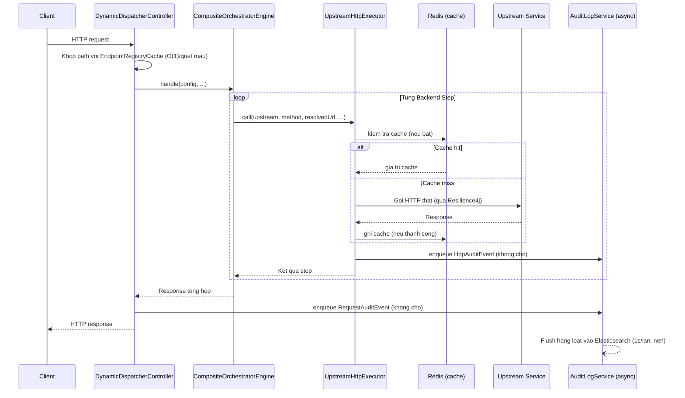

# SYSTEM ARCHITECTURE DOCUMENT (SAD)
# Hệ thống Gateway Manager (BCCS Composite API Gateway)

| | |
|---|---|
| **Mã tài liệu** | SAD-GWM-001 |
| **Phiên bản** | 1.0 |
| **Ngày phát hành** | 2026-09-06 |
| **Trạng thái** | Draft |
| **Tài liệu liên quan** | BRD-GWM-001, SRS-GWM-001, FDS-GWM-001 |
| **Đối tượng đọc** | Kiến trúc sư giải pháp, Trưởng nhóm kỹ thuật, Đội hạ tầng/DevOps |

---

## 1. Lịch sử thay đổi tài liệu

| Phiên bản | Ngày | Người soạn | Mô tả thay đổi |
|---|---|---|---|
| 1.0 | 2026-09-06 | Đội phát triển Gateway Manager | Khởi tạo tài liệu |
| 1.1 | 2026-09-08 | Đội phát triển Gateway Manager | Sửa lại ADR-03: bỏ Flyway/`ddl-auto`, chuyển sang mô hình DBA từng đội tự chạy DDL bàn giao |
| 1.2 | 2026-09-08 | Đội phát triển Gateway Manager | Cập nhật mục 5 (Deployment View) sang Kubernetes (YAML thuần, NGINX Ingress) làm topology chính thức, giữ Docker Compose làm phương án dev/demo |
| 2.0 | 2026-09-09 | Đội phát triển Gateway Manager | Tách Control Plane (dùng chung, multi-tenant qua `team_code`)/Data Plane (multi-instance, riêng từng đội) — đảo ngược ADR-01, sửa lại ADR-04, thêm ADR-07; viết lại mục 4 (Logical View) + mục 5 (Deployment View) hoàn toàn |

---

## 2. Giới thiệu

### 2.1. Mục đích

Tài liệu này mô tả **kiến trúc tổng thể** của hệ thống Gateway Manager ở mức
nhìn toàn cảnh (logic, triển khai, dữ liệu, tích hợp, bảo mật) — khác với
FDS-GWM-001 (đi sâu vào thiết kế chức năng/thuật toán cụ thể), SAD tập trung
vào **các quyết định kiến trúc lớn, ranh giới hệ thống, và cách các thành
phần phối hợp với nhau** — làm cơ sở cho việc đánh giá rủi ro kiến trúc, lập
kế hoạch hạ tầng, và ra quyết định khi mở rộng/thay đổi hệ thống trong tương
lai.

### 2.2. Phạm vi

Bao gồm kiến trúc của **Control Plane** (1 bản dùng chung mọi đội) và **Data
Plane** (mỗi đội 1 bản độc lập) — 2 vai trò tách biệt từ 2026-09 (xem ADR-07,
mục 9), cùng build từ 1 nguồn mã. Không bao gồm kiến trúc nội bộ của các
Upstream Service (backend thật) mà Gateway Manager gọi tới — các hệ thống đó
nằm ngoài ranh giới kiến trúc của tài liệu này.

### 2.3. Định nghĩa kiến trúc & ký hiệu

Sơ đồ trong tài liệu dùng cú pháp Mermaid. Thuật ngữ tham chiếu mục "Thuật
ngữ" của BRD-GWM-001.

---

## 3. Mục tiêu & Ràng buộc kiến trúc (Architecture Drivers)

Kiến trúc được dẫn dắt bởi các yêu cầu phi chức năng (NFR) trong SRS-GWM-001,
tóm tắt lại dưới góc độ quyết định kiến trúc:

| Driver | Yêu cầu gốc | Hệ quả kiến trúc |
|---|---|---|
| Thay đổi cấu hình có hiệu lực nhanh | BR-EP-08 | Tại Control Plane: có hiệu lực ngay lập tức (cùng tiến trình, đọc trực tiếp DB). Tại Data Plane: có hiệu lực trong tối đa 1 chu kỳ đồng bộ (mặc định 15s) — đánh đổi CÓ CHỦ ĐÍCH từ 2026-09 khi 2 tầng tách thành 2 tiến trình ở 2 nơi vật lý khác nhau, xem ADR-07 |
| Không nghẽn traffic thật khi hạ tầng phụ trợ lỗi | NFR-02 | Mọi tích hợp với Redis/Elasticsearch/APM phải theo nguyên tắc **fail-open** |
| Mỗi đội tự chịu tải hạ tầng thực thi traffic riêng | BR-DP-01..03 | Data Plane: không trạng thái chia sẻ GIỮA các instance, đóng gói dưới dạng ảnh container tự chứa. Control Plane: dùng chung 1 bản (cách ly dữ liệu qua `team_code`, không phải qua triển khai riêng — xem ADR-07) |
| Tương thích Oracle phiên bản cũ (19c) | NFR-07 | Không dùng kiểu dữ liệu/tính năng cơ sở dữ liệu chỉ có ở bản mới nhất; quản lý schema qua công cụ migration có kiểm soát phiên bản thay vì để ORM tự suy luận |
| Chi phí nội bộ không đáng kể so với gọi mạng | NFR-01 | Engine điều phối thiết kế nhẹ (thao tác bộ nhớ thuần Java), không thêm tầng trung gian mạng nào giữa việc nhận request và gọi Upstream |
| Không lập trình bất đồng bộ | Ràng buộc nền tảng | Toàn bộ ngăn xếp dùng mô hình đồng bộ (blocking I/O), đánh đổi lấy sự đơn giản/dễ debug, giới hạn thông lượng bởi kích thước thread pool |

---

## 4. Kiến trúc Logic (Logical View)

### 4.1. Sơ đồ thành phần

**TỪ 2026-09 (xem ADR-07, mục 9): Control Plane và Data Plane là 2 TIẾN
TRÌNH RIÊNG BIỆT** — cùng build từ 1 mã nguồn/1 image (`@Profile("control-plane")`
so với `@Profile("data-plane")`, chọn qua `SPRING_PROFILES_ACTIVE` lúc khởi
động), nhưng chạy độc lập, nối với nhau qua HTTP (`RemoteConfigSyncService`)
thay vì chia sẻ bộ nhớ trong-process như thiết kế ban đầu (ADR-01, nay đã bị
đảo ngược).

### 4.2. Trách nhiệm từng thành phần

| Thành phần | Chạy ở | Trách nhiệm | Ranh giới KHÔNG đảm nhiệm |
|---|---|---|---|
| **`*Controller` dưới `/api/**`** | Control Plane | CRUD cấu hình, quản lý đội, tra cứu log, xuất/nhập cấu hình, xem trước | KHÔNG xử lý traffic nghiệp vụ thật của client |
| **`TeamController`/`TeamService`** | Control Plane | CRUD bảng `gwm_team`, sinh `api_key` ngẫu nhiên cho từng đội | KHÔNG nằm dưới `CurrentTeamContext` (không thuộc phạm vi 1 đội cụ thể) |
| **`CurrentTeamContext`** | Control Plane | ThreadLocal mang `team_code` xuyên suốt 1 request — mọi query/ghi CRUD tự lọc theo giá trị này | KHÔNG tồn tại ở Data Plane (không cần — mỗi tiến trình Data Plane vốn chỉ phục vụ 1 đội) |
| **`DynamicDispatcherController`** | Data Plane | Nhận request client, khớp Endpoint, uỷ quyền cho engine, ghi audit | KHÔNG chứa logic điều phối chi tiết (uỷ quyền hết cho `CompositeOrchestratorEngine`) |
| **`RemoteConfigSyncService`** | Data Plane | Poll định kỳ `GET /api/config/export` (bằng `api_key` của chính đội), nạp kết quả vào `EndpointRegistryCache`/`UpstreamRegistryCache`, fail-open khi lỗi | KHÔNG kết nối Oracle, KHÔNG ghi gì lên Control Plane (chỉ đọc) |
| **`CompositeOrchestratorEngine`** | Cả 2 (không `@Profile`) | Điều phối thứ tự thực thi step, ánh xạ dữ liệu, gộp response — dùng chung cho traffic thật (Data Plane) VÀ "Thử ngay"/"Thử nhanh" (Control Plane) | KHÔNG tự thực hiện lệnh gọi HTTP (uỷ quyền `UpstreamHttpExecutor`) |
| **`UpstreamHttpExecutor`** | Cả 2 | Thực hiện 1 lệnh gọi HTTP cụ thể, bọc cache/circuit-breaker/retry/bulkhead/audit | KHÔNG biết gì về thứ tự/logic tổng thể của cả chuỗi Endpoint |
| **`EndpointRegistryCache`** | Data Plane (Control Plane không dùng — không dispatch traffic) | Bộ nhớ đệm thuần (không tự đọc JPA nữa) — nạp bởi `RemoteConfigSyncService` | KHÔNG phải nguồn sự thật — Oracle (qua Control Plane) mới là nguồn thật |
| **`UpstreamRegistryCache`** | Cả 2, nguồn dữ liệu khác nhau | Control Plane: nạp TOÀN BỘ Upstream mọi đội (phục vụ Try — an toàn vì quyền sở hữu đã kiểm tra trước khi tới đây); Data Plane: CHỈ Upstream của chính đội (qua sync) | KHÔNG phải nguồn sự thật |
| **`GatewayCacheService`** | Cả 2 | Cache-aside cho kết quả lệnh gọi (theo step hoặc toàn bộ response) | KHÔNG cache cấu hình |
| **`AuditLogService`** | Cả 2 | Ghi nhật ký bất đồng bộ, fail-open — ghi cả traffic thật (Data Plane) lẫn lệnh gọi từ "Thử ngay" (Control Plane, nếu bật) | KHÔNG phục vụ tra cứu (đó là `LogSearchService`, chỉ chạy ở Control Plane) |
| **`TraceCollector`** | Control Plane (qua engine dùng chung) | Thu thập chi tiết từng bước CHO 1 lần "Thử ngay/nhanh", hoàn toàn trong bộ nhớ | KHÔNG liên quan pipeline audit Elasticsearch |
| **Frontend Angular** | Control Plane | Giao diện khai báo (form/canvas), tra cứu, xem trước | KHÔNG chứa logic nghiệp vụ điều phối, KHÔNG triển khai ở Data Plane |

---

## 5. Kiến trúc Triển khai (Deployment View)

### 5.1. Control Plane — 1 cụm/namespace DUY NHẤT, đội nền tảng triển khai

**Topology chính thức: Kubernetes** (YAML thuần trong `k8s/control-plane/`,
`kubectl apply`, không Helm — xem `k8s/control-plane/README.md` và
`DEPLOYMENT_GUIDE.md` mục 3). Docker Compose
(`docker-compose.control-plane.yml`) được giữ song song cho dev/demo 1 host.

- **Ingress** định tuyến theo **2 host** (xem `k8s/control-plane/60-ingress.yaml`):
  1 host cho UI quản trị (→ `gwm-frontend`) và 1 host cho API — dùng bởi cả
  trình duyệt (gián tiếp, qua proxy của frontend) LẪN **`RemoteConfigSyncService`
  của MỌI Data Plane** (mọi đội, có thể ở cụm/mạng hoàn toàn khác) gọi về
  định kỳ để đồng bộ cấu hình — khác bản trước 2026-09 (khi host "API" tồn
  tại để client thật bỏ qua frontend gọi thẳng traffic nghiệp vụ; giờ traffic
  nghiệp vụ thật hoàn toàn không đi qua Control Plane nữa).
- **`gwm-backend`** (Control Plane) đọc cấu hình từ `gwm-config`/`gwm-secret`,
  kết nối **trực tiếp** Oracle trung tâm — **không có Redis/ES bắt buộc**
  (Redis chỉ phục vụ cache tạm khi dùng "Thử ngay", tuỳ chọn).
- Chỉ **1 bản** cho toàn hệ thống — không nhân bản theo đội.

### 5.2. Data Plane — MỖI ĐỘI 1 namespace/cụm RIÊNG, đội đó tự triển khai

- **KHÔNG có frontend, KHÔNG có ConfigMap `DB_*`** (khác hẳn bản trước
  2026-09) — Data Plane không kết nối Oracle, chỉ cần `TEAM_CODE`+
  `CONTROL_PLANE_BASE_URL`+`CONTROL_PLANE_SYNC_API_KEY` để tự đồng bộ cấu
  hình của chính đội mình.
- **`gwm-redis`** là 1 Deployment thường, **không có PersistentVolume** —
  cache-aside + bộ đếm rate-limit đều fail-open (ADR-05), mất dữ liệu khi Pod
  restart chỉ làm nguội cache tạm thời.
- Mỗi đội tự chịu tải hạ tầng của chính mình — hoàn toàn độc lập, đội này
  restart/sập không ảnh hưởng đội khác (đúng ADR-04, xem giải thích lại bên
  dưới).

### 5.3. Thay thế cho dev/demo 1 host: Docker Compose

`docker-compose.control-plane.yml` và `docker-compose.data-plane.yml` (2 file
RIÊNG, khác hẳn 1 file duy nhất trước 2026-09) mô phỏng đúng 5.1/5.2 trên 1
máy — mỗi file tự có network/Redis riêng, `frontend/nginx.conf.template`
dùng chung 1 cơ chế `resolver` động cho cả Docker lẫn Kubernetes (xem
`docker-entrypoint.sh`).

### 5.4. Nhiều đội — Control Plane dùng chung DỮ LIỆU (cách ly qua `team_code`), Data Plane vẫn multi-instance

**Thay đổi so với trước 2026-09 (xem ADR-04 sửa lại, ADR-07)**: DỮ LIỆU cấu
hình (Endpoint/Upstream) giờ **dùng chung 1 Oracle trung tâm**, cách ly giữa
các đội qua cột `team_code` (không còn "mỗi đội 1 Oracle riêng"). NHƯNG tầng
**thực thi traffic thật (Data Plane) vẫn multi-instance hoàn toàn** — mỗi đội
1 bản độc lập, tự chịu tải, sập/quá tải không ảnh hưởng đội khác — lý do ban
đầu của ADR-04 (cách ly tải, cách ly lỗi hạ tầng) vẫn đúng cho phần THỰC THI,
chỉ không còn đúng cho phần LƯU CẤU HÌNH. Elasticsearch/APM vẫn là hạ tầng
TUỲ CHỌN dùng chung (nếu muốn) — không đổi.

### 5.5. Vòng đời khởi động

Việc tạo schema (bước 0 dưới đây) diễn ra **1 lần, TRƯỚC** và **NGOÀI** vòng
đời Control Plane, do DBA của đội nền tảng thực hiện thủ công (xem ADR-03,
mục 9).

---

## 6. Kiến trúc Dữ liệu (Data Architecture)

### 6.1. Phân loại dữ liệu

| Loại dữ liệu | Nơi lưu | Vòng đời |
|---|---|---|
| Cấu hình (Upstream, Endpoint, Step, Mapping) | Oracle | Bền vững, có kiểm soát phiên bản (Flyway cho schema, `EndpointConfigVersion` cho nội dung) |
| Lịch sử phiên bản cấu hình | Oracle (CLOB snapshot JSON) | Bền vững, tăng dần theo thời gian, xoá theo Endpoint khi Endpoint bị xoá |
| Cache kết quả lệnh gọi (theo step / toàn bộ response) | Redis | Tạm thời, tự hết hạn theo TTL (jitter ±15%) |
| Bộ đếm rate-limit | Redis | Tạm thời, tự hết hạn theo window |
| Nhật ký request/hop | Elasticsearch | Bền vững theo chính sách lưu trữ riêng của đội (rolling index theo ngày) |
| Cấu hình đang hoạt động (routing, tại Data Plane) | Bộ nhớ JVM (`EndpointRegistryCache`/`UpstreamRegistryCache`) | Tạm thời — nạp qua `RemoteConfigSyncService` (poll HTTP tới Control Plane, mặc định 15s/lần), KHÔNG còn đọc Oracle trực tiếp từ 2026-09 (xem ADR-07) |
| Cấu hình đang hoạt động (routing, tại Control Plane) | Bộ nhớ JVM (chỉ `UpstreamRegistryCache`, phục vụ "Thử ngay/nhanh") | Tạm thời, tái tạo từ Oracle mỗi khi khởi động hoặc mỗi khi CRUD Upstream thay đổi |
| Chi tiết từng bước của 1 lần "Thử ngay/nhanh" | Bộ nhớ JVM (`ThreadLocal`, `TraceCollector`) | Cực ngắn — chỉ tồn tại trong đúng 1 vòng đời request, không lưu ở đâu khác |

### 6.2. Dòng chảy dữ liệu chính (khi client gọi 1 Endpoint)

Điểm mấu chốt: việc ghi audit (`enqueue`) diễn ra **trước khi trả response**
nhưng KHÔNG chặn — chỉ là thao tác thêm vào hàng đợi trong bộ nhớ, việc ghi
thật vào Elasticsearch xảy ra SAU, trên 1 thread nền riêng, không nằm trên
đường xử lý request của client.

---

## 7. Kiến trúc Tích hợp (Integration Architecture)

| Tích hợp | Giao thức | Kiểu kết nối | Bắt buộc? | Chiến lược khi lỗi |
|---|---|---|---|---|
| Oracle (CHỈ Control Plane — Data Plane không kết nối) | JDBC (HikariCP pool, tối đa 10 connection) | Đồng bộ | **Bắt buộc cho Control Plane** | Control Plane không khởi động được nếu không kết nối được lúc đầu (Hibernate `ddl-auto=validate` cần schema hợp lệ) |
| Data Plane → Control Plane (đồng bộ cấu hình) | HTTP REST (`GET /api/config/export`, poll định kỳ) | Đồng bộ, 1 chiều (Data Plane chủ động gọi ra) | Tuỳ chọn về mặt vận hành (fail-open) | Fail-open: giữ nguyên cache cũ trong bộ nhớ, tự thử lại chu kỳ sau (mặc định 15s), KHÔNG chặn traffic thật đang chạy — xem ADR-07 |
| Redis | Giao thức Redis (`StringRedisTemplate`, kết nối trễ) | Đồng bộ | Tuỳ chọn về mặt vận hành | Fail-open: cache-miss/bỏ qua rate-limit, request thật vẫn xử lý |
| Elasticsearch | HTTP REST | Đồng bộ (ghi qua hàng đợi + thread nền) | Tuỳ chọn | Fail-open cho GHI (mất log, không chặn); báo lỗi rõ ràng cho ĐỌC (tra cứu) |
| Elastic APM Server | Giao thức APM riêng (qua Java Agent) | Bất đồng bộ (do agent quản lý) | Tuỳ chọn | Agent tự tắt/backoff khi không kết nối được, không ảnh hưởng ứng dụng |
| Upstream Service (bất kỳ) | HTTP/REST | Đồng bộ (`RestTemplate`, timeout theo cấu hình) | Theo từng Endpoint | Circuit breaker/retry/bulkhead theo cấu hình; lỗi trả về client dưới dạng lỗi nghiệp vụ rõ ràng |

**Nguyên tắc tích hợp chung**: hạ tầng nào ảnh hưởng trực tiếp tới TÍNH ĐÚNG
ĐẮN của dữ liệu cấu hình (Oracle) là **bắt buộc**; hạ tầng nào chỉ phục vụ
TỐI ƯU HOÁ hoặc QUAN SÁT (Redis, Elasticsearch, APM) đều **tuỳ chọn và
fail-open** — không đội nào bị chặn triển khai chỉ vì chưa có đủ 3 hạ tầng
phụ trợ đó.

---

## 8. Kiến trúc Bảo mật (Security Architecture)

| Lớp | Cơ chế | Ghi chú |
|---|---|---|
| Quản lý đội (`/api/teams/**`) | Header khoá API (`X-Gateway-Admin-Key`) = **platform-admin key** (`GATEWAY_ADMIN_API_KEY`), so khớp qua `ApiKeyAuthFilter` | Chỉ đội NỀN TẢNG mới có khoá này — thu hẹp phạm vi rủi ro nếu lộ (không dùng được cho `/api/endpoints`/`/api/upstreams` của bất kỳ đội nào) |
| Control Plane CRUD (`/api/endpoints`, `/api/upstreams`, `/api/config`, `/api/logs`) | Header khoá API = **`api_key` riêng của từng đội** (bảng `gwm_team`, tự sinh 256-bit khi tạo đội), khớp key nào gán `CurrentTeamContext` (ThreadLocal) đúng `team_code` đó | MỌI query/ghi CRUD tự động lọc theo `CurrentTeamContext.require()` — 1 đội không thấy/sửa được cấu hình đội khác dù đoán đúng ID (IDOR đã chặn ở nhiều điểm: `EndpointMapper`, `EndpointVersionService`, `EndpointTryService`) |
| Đồng bộ Data Plane → Control Plane | Cùng cơ chế `api_key` riêng từng đội ở trên — `RemoteConfigSyncService` dùng CHÍNH `api_key` của đội mình gọi `GET /api/config/export` | Không cần API/loại khoá riêng cho việc đồng bộ |
| Data Plane (client gọi Endpoint) | KHÔNG có cơ chế xác thực tại tầng gateway | Việc xác thực (nếu cần) là trách nhiệm của Endpoint tự chuyển tiếp header xác thực gốc của client sang Upstream Service qua Field Mapping (targetType=HEADER) |
| Đường dẫn dành riêng | Chặn khai báo Endpoint trùng tiền tố `/api` hoặc `/actuator` | Tránh Endpoint composite vô tình bị `ApiKeyAuthFilter` chặn nhầm |
| Dữ liệu nhạy cảm trong log | Cắt bớt (truncate) nội dung request/response trước khi ghi audit, đánh dấu rõ khi bị cắt | Giới hạn độ dài, không giới hạn theo field nhạy cảm cụ thể (không có data masking theo tên field) |
| Bí mật cấu hình (mật khẩu DB, khoá API) | Truyền qua biến môi trường — `.env` hoặc `Secret` Kubernetes `gwm-secret` — không commit giá trị thật vào mã nguồn | Không có tích hợp vault/secret-manager tập trung ở phiên bản hiện tại |

**Giới hạn đã biết**: `api_key` của từng đội trong bảng `gwm_team` lưu
**plaintext** (không hash/salt) — nhất quán với cách `GATEWAY_ADMIN_API_KEY`
đã lưu từ trước (không có hạ tầng hash nào trong toàn bộ ứng dụng), nhưng
KÉM AN TOÀN HƠN thông lệ tốt (lưu hash, hiện plaintext đúng 1 lần lúc tạo).
Ghi nhận là giới hạn đã biết ở V1, tương tự PII chưa được redact trước khi
ghi audit log — không chặn việc dùng, có thể nâng cấp sau nếu cần. Trong 1
đội vẫn chỉ có **1 khoá dùng chung**, không có RBAC chi tiết (mọi người có
khoá của đội đều toàn quyền quản trị cấu hình của đội đó).

---

## 9. Các Quyết định Kiến trúc Quan trọng (Architecture Decision Records)

### ADR-01: Control Plane và Data Plane chạy chung 1 tiến trình — **ĐÃ BỊ ĐẢO NGƯỢC, xem ADR-07**

> **ĐÃ ĐẢO NGƯỢC (2026-09)**: quyết định dưới đây đúng khi còn giữ nguyên bối
> cảnh ban đầu (mỗi đội 1 instance độc lập hoàn toàn), nhưng bài toán đã đổi
> — Control Plane giờ dùng chung 1 Oracle trung tâm cho MỌI đội, còn Data
> Plane vẫn triển khai riêng từng đội. 2 tầng này giờ ở 2 nơi vật lý khác
> nhau, không thể còn là 1 tiến trình. Xem đầy đủ lý do + thiết kế thay thế ở
> **ADR-07**. Nội dung gốc giữ nguyên bên dưới để lưu lại bối cảnh/lý do của
> quyết định ban đầu.

- **Bối cảnh (ban đầu)**: cần cấu hình có hiệu lực ngay lập tức khi lưu, không delay.
- **Quyết định (ban đầu)**: gộp Control Plane (CRUD API) và Data Plane (thực
  thi traffic thật) vào CÙNG 1 ứng dụng Spring Boot, chia sẻ bộ nhớ đệm cấu
  hình trong-process (`EndpointRegistryCache`).
- **Đánh đổi (ban đầu)**: đơn giản hoá triển khai (1 tiến trình duy nhất),
  nhưng traffic quản trị và traffic nghiệp vụ dùng chung tài nguyên CPU/thread
  pool của 1 JVM — không tách được scale riêng cho từng loại traffic.

### ADR-02: Phân phối bằng Docker image versioned, không phải thư viện Maven

- **Bối cảnh**: cần cách để nhiều đội BCCS tự triển khai 1 bản riêng của hệ
  thống hoàn chỉnh (UI + API + schema riêng), không phải 1 lát cắt hạ tầng
  dùng chung kiểu thư viện.
- **Đã cân nhắc**: (a) đóng gói thành thư viện/starter Spring Boot để đội
  khác nhúng vào ứng dụng của họ; (b) copy-fork mã nguồn cho từng đội (theo
  đúng khuôn mẫu `render-template.ps1` sẵn có của nền tảng BCCS cho các
  service khác).
- **Quyết định**: phân phối dưới dạng **ảnh Docker gắn phiên bản** (image
  versioned), build từ 1 nguồn mã DUY NHẤT, mỗi đội `pull` + tự cấu hình
  `.env` trỏ hạ tầng riêng.
- **Lý do loại phương án (a)**: hệ thống là 1 ứng dụng hoàn chỉnh (sở hữu
  schema/API/UI riêng), không phải hạ tầng dùng chung kiểu cache/kết nối HTTP
  — ép thành thư viện đòi hỏi tách toàn bộ tầng persistence/controller ra
  khỏi 1 ứng dụng liền khối, khối lượng refactor lớn, chưa có tiền lệ nào
  tương tự trong nền tảng BCCS.
- **Lý do loại phương án (b)**: copy-fork không có kênh nhận cập nhật/bản vá
  sau này — mã nguồn sẽ phân mảnh dần theo thời gian giữa các đội.
- **Cập nhật (2026-09-08)**: topology chạy ảnh Docker này ở từng đội được
  chốt cụ thể là **Kubernetes** (YAML thuần, `kubectl apply`, không Helm — xem
  mục 5.1, `k8s/README.md`), không chỉ dừng lại quyết định "đóng gói bằng
  Docker image" — quyết định đóng gói ở ADR này giữ nguyên không đổi, chỉ nơi
  CHẠY ảnh đó cụ thể hoá thành Kubernetes thay vì để ngỏ. Docker Compose vẫn
  dùng được cho dev/demo 1 host (mục 5.1b) vì cùng 1 ảnh Docker chạy được
  trên cả 2 topology.

### ADR-03: Bỏ `hibernate.ddl-auto=update`; schema do DBA từng đội tự tạo qua DDL bàn giao — KHÔNG để ứng dụng tự động tạo/sửa schema (đã sửa lại 1 lần)

- **Bối cảnh**: cần đảm bảo schema hoạt động đúng trên Oracle phiên bản cũ
  hơn (19c) mà nhiều đội BCCS đang dùng, trong khi môi trường phát triển nội
  bộ chỉ có Oracle 23c.
- **Quyết định lần đầu (đã thay thế)**: chuyển sang Flyway (SQL migration
  viết tay, tự động `migrate()` khi ứng dụng khởi động) + `ddl-auto=validate`.
- **Phát hiện quan trọng trong quá trình xác minh quyết định lần đầu**:
  `ddl-auto=update` (cách cũ hơn nữa) từng khiến Hibernate tự sinh SAI kiểu
  cột `BOOLEAN` (chỉ có từ Oracle 23c) cho 1 số cột thêm sau — đã phải sửa tay
  các cột này về đúng `NUMBER(1,0)` trên dữ liệu thật, và xác nhận
  `hibernate.type.preferred_boolean_jdbc_type=INTEGER` (không phải `NUMERIC`)
  là giá trị đúng để vừa đối chiếu (validate) đúng vừa đọc/ghi dữ liệu boolean
  chính xác — **kết luận này vẫn giữ nguyên, không đổi** ở quyết định sửa lại
  dưới đây.
- **Lý do sửa lại quyết định Flyway-tự-migrate**: Oracle 19c thật của từng đội
  BCCS không phải schema trống tự do — là **hạ tầng đã vận hành từ trước, do
  DBA quản trị tập trung**. User cấp cho ứng dụng chạy THƯỜNG CHỈ có quyền DML
  (SELECT/INSERT/UPDATE/DELETE), KHÔNG có quyền DDL (`CREATE TABLE`) — giả
  định "Flyway tự `migrate()` lúc khởi động" không đúng với thực tế cấp quyền
  của các hạ tầng Oracle governed này, đồng thời nhiều schema là schema DÙNG
  CHUNG với hệ thống khác của chính đội đó (rủi ro trùng tên bảng nếu không
  rà soát trước khi tạo).
- **Quyết định sau cùng**: bỏ hẳn Flyway khỏi ứng dụng (gỡ dependency +
  `FlywayConfig`). Ứng dụng CHỈ còn `hibernate.ddl-auto=validate` — đối chiếu
  entity với schema thật lúc khởi động, không bao giờ tự tạo/sửa gì. Việc TẠO
  SCHEMA tách hẳn ra khỏi vòng đời ứng dụng: đội phát triển nền tảng bàn giao
  file DDL thuần (`db/team-schema/V1__baseline.sql`, các bản nâng cấp sau này
  là `V2__...sql`...) cho **DBA của từng đội tự rà soát trùng tên bảng + tự
  chạy** theo đúng quy trình change-management nội bộ của họ, sau đó mới cấp
  cho ứng dụng 1 user RUNTIME chỉ có quyền DML. Xem quy trình đầy đủ trong
  `DEPLOYMENT_GUIDE.md` mục 2.
- **Bài học rút ra**: khi thiết kế cho nhiều đội tự triển khai trên hạ tầng
  RIÊNG của họ, không nên mặc định hạ tầng đó "sạch/tự do toàn quyền" như môi
  trường phát triển nội bộ — cần hỏi rõ mô hình cấp quyền/quản trị hạ tầng
  thật của bên tiếp nhận trước khi chọn cơ chế tự động hoá.

### ADR-04: Mô hình nhiều instance độc lập, không phải multi-tenant dùng chung — **SỬA LẠI MỘT PHẦN (2026-09), xem ADR-07**

> **SỬA LẠI**: đúng cho tầng **thực thi traffic thật (Data Plane)** — vẫn
> multi-instance hoàn toàn, không đổi. KHÔNG còn đúng cho tầng **lưu cấu
> hình (Control Plane/Oracle)** — giờ multi-tenant thật (1 Oracle dùng chung,
> cách ly qua cột `team_code`), vì bài toán đã đổi từ "mỗi đội hạ tầng riêng
> hoàn toàn" sang "DB/Web dùng chung, chỉ thực thi traffic mới tách riêng
> từng đội". Xem ADR-07 cho lý do đầy đủ.

- **Bối cảnh (ban đầu)**: mỗi đội BCCS có Oracle/Redis/Elasticsearch RIÊNG.
- **Quyết định (ban đầu)**: mỗi đội chạy 1 instance hoàn toàn độc lập (dữ
  liệu, cache, registry trong bộ nhớ) — không xây dựng cơ chế phân biệt
  tenant-id trong 1 instance dùng chung.
- **Lý do (ban đầu)**: hạ tầng đã sẵn tách biệt theo đội, xây multi-tenancy
  (cách ly dữ liệu theo tenant trong CÙNG 1 schema/Redis) sẽ là công sức thừa
  không giải quyết thêm vấn đề gì, đồng thời tăng rủi ro rò rỉ dữ liệu chéo
  giữa các đội nếu cách ly tenant có sai sót.
- **Vẫn còn đúng cho Data Plane**: Redis vẫn riêng từng đội, Data Plane vẫn
  multi-instance hoàn toàn (không đổi) — lý do "cách ly tải/lỗi hạ tầng" vẫn
  áp dụng nguyên vẹn cho tầng thực thi.
- **Không còn đúng cho Control Plane**: giờ multi-tenant thật (đã xây cơ chế
  `team_code` + `CurrentTeamContext` — chính điều mà quyết định ban đầu này
  từng cho là "công sức thừa") — vì bài toán đổi, không phải vì lý do gốc sai.

### ADR-05: Nguyên tắc "fail-open" cho mọi hạ tầng phụ trợ

- **Bối cảnh**: cache (Redis), audit (Elasticsearch), giám sát (APM) không
  phải hạ tầng mọi đội đều có sẵn ngay từ đầu.
- **Quyết định**: mọi lỗi từ 3 hệ thống này chỉ được log cảnh báo, KHÔNG được
  ném lỗi ra ảnh hưởng luồng xử lý request thật.
- **Đánh đổi**: chấp nhận MẤT một phần dữ liệu quan sát (cache-miss nhiều
  hơn, thiếu vài dòng log) khi hạ tầng phụ trợ chập chờn, đổi lấy việc traffic
  nghiệp vụ không bao giờ bị ảnh hưởng bởi sự cố của hạ tầng không thiết yếu.

### ADR-06: Chặn cứng (không chỉ cảnh báo) đối với cache toàn bộ response trên endpoint không phải GET/POST

- **Bối cảnh**: cache toàn bộ response dùng CHUNG cho MỌI client — nếu áp
  dụng nhầm cho 1 lệnh có side-effect thật, 2 client khác nhau có thể nhận
  nhầm kết quả hành động của nhau.
- **Quyết định**: validate CHẶN CỨNG lúc lưu cấu hình (không cho lưu) nếu
  Endpoint hoặc bất kỳ step nào không phải GET/POST, thay vì chỉ cảnh báo
  mềm như 1 số tính năng rủi ro khác (ví dụ `parallelExecution`).
- **Lý do phân biệt mức độ cứng/mềm**: rủi ro của tính năng này (rò rỉ dữ
  liệu CHÉO giữa các client không liên quan) nghiêm trọng và khó phát hiện
  hơn hẳn rủi ro của `parallelExecution` (chỉ ảnh hưởng NỘI BỘ 1 giao dịch
  của đúng 1 client đang gọi).

### ADR-07: Tách Control Plane (dùng chung, multi-tenant qua `team_code`) / Data Plane (multi-instance, riêng từng đội) — đảo ngược ADR-01, sửa lại ADR-04

- **Bối cảnh**: bài toán triển khai đổi hoàn toàn so với lúc thiết kế ban đầu
  (ADR-01/ADR-02/ADR-04). Trước: "mỗi đội 1 instance độc lập hoàn toàn" (DB +
  Web + thực thi cùng 1 nơi). Sau: **"DB và Web (UI quản trị) dùng chung 1
  bản duy nhất cho mọi đội, chỉ tầng thực thi traffic thật (Data Plane) mới
  đẩy về triển khai riêng tại hạ tầng từng đội"** — do đội nền tảng chủ động
  đổi định hướng (không phải phát hiện lỗi trong thiết kế cũ).
- **Hệ quả trực tiếp lên ADR-01**: tiền đề "1 tiến trình duy nhất để cấu hình
  có hiệu lực ngay lập tức" không còn đúng — Control Plane (dùng chung) và
  Data Plane (từng đội) giờ ở **2 nơi vật lý khác nhau** (có thể khác cụm
  Kubernetes, khác mạng hoàn toàn), không thể tiếp tục chia sẻ bộ nhớ
  trong-process.
- **Quyết định**: tách thành **2 Spring Profile** (`control-plane`/
  `data-plane`), chọn qua `SPRING_PROFILES_ACTIVE` lúc khởi động — **vẫn 1
  nguồn mã, 1 image Docker duy nhất** (giữ nguyên tinh thần ADR-02, không đảo
  ngược quyết định đó) — không tách thành 2 dự án/2 repository riêng.
  - **Control Plane**: 1 bản DUY NHẤT, đội nền tảng triển khai, kết nối
    **trực tiếp** Oracle trung tâm. Cách ly dữ liệu giữa các đội qua cột
    `team_code` mới (bảng `upstream_service`/`endpoint_config`) +
    `CurrentTeamContext` (ThreadLocal, set bởi `ApiKeyAuthFilter` sau khi tra
    `api_key` trong bảng `gwm_team` mới) — MỌI query/ghi CRUD tự động lọc
    theo giá trị này.
  - **Data Plane**: mỗi đội tự triển khai 1 bản riêng — **không còn kết nối
    Oracle** (loại hẳn `spring.datasource.*`/JPA qua
    `spring.autoconfigure.exclude`), thay vào đó tự đồng bộ Endpoint/Upstream
    của CHÍNH đội mình qua `RemoteConfigSyncService`: poll định kỳ (mặc định
    15s) `GET /api/config/export` bằng chính `api_key` của đội (endpoint này
    tự lọc theo đội gọi vào — không cần xây API riêng cho việc đồng bộ).
- **Vì sao poll thay vì push/webhook**: Control Plane và Data Plane giờ có
  thể ở 2 mạng không thông nhau theo chiều Control Plane → Data Plane (mỗi
  đội tự quản lý hạ tầng riêng, không đảm bảo mở được cổng vào từ bên ngoài)
  — poll (chiều Data Plane → Control Plane, đội nào cũng chủ động gọi ra
  được) đơn giản và chắc chắn hoạt động hơn, đánh đổi lấy độ trễ tối đa 1 chu
  kỳ poll thay vì tức thời (chấp nhận được — khác hẳn ADR-01 gốc, 2 tầng vốn
  đã ở 2 nơi vật lý khác nhau nên không còn khả năng "tức thời" bằng bất kỳ
  cơ chế nào).
- **Fail-open khi mất kết nối** (nhất quán ADR-05): `RemoteConfigSyncService`
  lỗi HTTP chỉ log cảnh báo, GIỮ NGUYÊN cấu hình cũ trong bộ nhớ, tự thử lại
  chu kỳ sau — không bao giờ làm rỗng cache/chặn traffic thật đang chạy chỉ
  vì 1 lần đồng bộ thất bại.
- **`UpstreamRegistryCache` là ngoại lệ có chủ đích**: khác `EndpointRegistryCache`
  (bỏ hoàn toàn khỏi Control Plane — không ai đọc), `UpstreamRegistryCache`
  VẪN chạy ở cả 2 profile vì `CompositeOrchestratorEngine` dùng chung cho cả
  Data Plane (traffic thật) LẪN tính năng "Thử ngay"/"Thử nhanh" (Control
  Plane). Ở Control Plane, cache này nạp TOÀN BỘ Upstream của MỌI đội (không
  lọc `CurrentTeamContext`) — an toàn vì quyền sở hữu đã được kiểm tra RIÊNG,
  SỚM HƠN trong luồng xử lý (`EndpointMapper.findUpstreamOrThrow()` lúc lưu
  thật, `EndpointTryService.validateUpstreamOwnership()` lúc "Thử nhanh") —
  tới lúc engine gọi `getById()`, quyền đã được xác nhận, tra cứu ở đây chỉ
  là bước nội bộ, không phải điểm kiểm soát truy cập.
- **Xác minh bằng cách khởi động thật (không chỉ unit test)**: cả 2 profile
  đã được khởi động bằng jar thật để xác nhận toàn bộ wiring Spring đúng —
  quá trình này phát hiện 1 lỗi thật (`TeamController` thiếu `@Profile`, tạo
  từ trước khi có khái niệm profile) mà bộ unit test (không boot context đầy
  đủ) không thể bắt được — đã sửa và xác nhận lại.
- **Không làm trong phạm vi này**: không xây RBAC chi tiết trong 1 đội (vẫn 1
  `api_key` = toàn quyền CRUD của đội đó); không hash/salt `api_key` trong
  `gwm_team` ở V1 (ghi nhận là giới hạn đã biết, tương tự PII chưa redact
  trước khi ghi audit log).

## 10. Rủi ro kiến trúc & Nợ kỹ thuật (Architecture Risks & Technical Debt)

| # | Rủi ro/Nợ kỹ thuật | Ảnh hưởng | Đề xuất theo dõi |
|---|---|---|---|
| AR-1 | Không tách được scale Control Plane và Data Plane (ADR-01) | 1 đợt quản trị nhiều (import cấu hình lớn) có thể ảnh hưởng độ trễ traffic thật cùng lúc | Theo dõi nếu tần suất thao tác Control Plane tăng cao, cân nhắc tách tiến trình trong tương lai |
| AR-2 | Không có RBAC cho Control Plane (mục 8) | Mọi người có khoá API đều có toàn quyền | Chấp nhận được ở quy mô 1 đội tự quản lý; cần đánh giá lại nếu 1 instance được nhiều đội con cùng truy cập |
| AR-3 | Chưa kiểm thử trên Oracle 19c thật (chỉ 23c-free) | Rủi ro phát sinh khác biệt hành vi khi triển khai thật lần đầu | Khuyến nghị kiểm thử thật trên Oracle 19c trước khi giao cho đội đầu tiên dùng phiên bản đó |
| AR-4 | Mô hình đồng bộ hoàn toàn giới hạn thông lượng bởi kích thước thread pool (Tomcat + `parallelStepExecutor`) | Không tận dụng được I/O bất đồng bộ khi số lượng Upstream Service/độ trễ mạng lớn | Chấp nhận có chủ đích (ràng buộc nền tảng "không lập trình reactive") — nếu cần thông lượng cao hơn, cần đánh giá lại ràng buộc này ở tầm nền tảng, không chỉ riêng hệ thống này |
| AR-5 | Bù trừ nghiệp vụ (compensation) là best-effort, không đảm bảo tuyệt đối | Dữ liệu có thể không nhất quán nếu chính lệnh bù trừ cũng thất bại | Ghi nhận đầy đủ lỗi bù trừ để xử lý thủ công; không dùng cho nghiệp vụ bắt buộc toàn vẹn tuyệt đối (xem thêm BRD mục 11) |

---

## 11. Phụ lục

### 11.1. Tài liệu liên quan

- BRD-GWM-001 — Yêu cầu nghiệp vụ.
- SRS-GWM-001 — Yêu cầu hệ thống chi tiết.
- FDS-GWM-001 — Thiết kế chức năng/thuật toán chi tiết.
- `README.md`, `LOCAL_SETUP.md`, `DEPLOYMENT_GUIDE.md` — tài liệu vận hành.

### 11.2. Bảng viết tắt

| Viết tắt | Ý nghĩa |
|---|---|
| SAD | System Architecture Document |
| ADR | Architecture Decision Record |
| TTL | Time To Live |
| RBAC | Role-Based Access Control |
