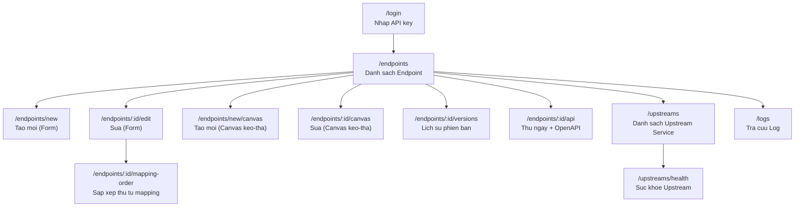

# UI/UX DESIGN DOCUMENT
# Hệ thống Gateway Manager (BCCS Composite API Gateway)

| | |
|---|---|
| **Mã tài liệu** | UIUX-GWM-001 |
| **Phiên bản** | 1.0 |
| **Ngày phát hành** | 2026-09-06 |
| **Trạng thái** | Draft |
| **Tài liệu liên quan** | SRS-GWM-001 (mục 4.1), FDS-GWM-001 (mục 9) |

> **Lưu ý phạm vi tài liệu**: hệ thống hiện KHÔNG có file thiết kế Figma
> (wireframe/prototype có sẵn) — giao diện được xây dựng trực tiếp bằng
> Angular Material theo 1 hệ thống design token nhất quán (mục 2). Tài liệu
> này mô tả **wireframe dạng văn bản/sơ đồ** và **design system** được trích
> xuất trực tiếp từ mã nguồn giao diện đang chạy thật (nguồn sự thật duy
> nhất), để phục vụ tham chiếu thiết kế và làm cơ sở nếu sau này dựng file
> Figma chính thức.

---

## 1. Lịch sử thay đổi tài liệu

| Phiên bản | Ngày | Người soạn | Mô tả |
|---|---|---|---|
| 1.0 | 2026-09-06 | Đội phát triển Gateway Manager | Khởi tạo, mô tả đúng giao diện đang triển khai |

---

## 2. Design System

### 2.1. Bảng màu (Color Tokens)

Định nghĩa tại `frontend/src/styles.scss` dưới dạng CSS Custom Property,
dùng xuyên suốt toàn bộ ứng dụng (không hard-code mã màu rải rác trong từng
component).

| Token | Giá trị | Vai trò |
|---|---|---|
| `--gwm-primary` | `#4f46e5` (Indigo) | Màu chủ đạo — nút chính, trạng thái active, focus |
| `--gwm-primary-dark` | `#3730a3` | Primary khi hover/nhấn |
| `--gwm-primary-light` | `#eef2ff` | Nền nhạt cho trạng thái active (menu, chip) |
| `--gwm-accent` | `#0891b2` (Cyan) | Điểm nhấn phụ |
| `--gwm-accent-light` | `#ecfeff` | Nền nhạt cho accent (vd chip "cache hit") |
| `--gwm-brand-red` / `--gwm-brand-red-dark` | `#ee0033` / `#a4001f` | **Riêng cho logo mark "vOrchestra"** ở header — theo nhận diện thương hiệu Viettel, KHÔNG dùng cho bất kỳ thành phần nào khác |
| `--gwm-bg` | `#f8fafc` | Nền trang |
| `--gwm-surface` | `#ffffff` | Nền thẻ/card/panel |
| `--gwm-border` / `--gwm-border-strong` | `#e2e8f0` / `#cbd5e1` | Viền mảnh (thay cho đổ bóng nặng) |
| `--gwm-text` / `--gwm-text-secondary` / `--gwm-text-muted` | `#0f172a` / `#475569` / `#94a3b8` | 3 cấp độ chữ theo mức độ quan trọng |
| `--gwm-success` / `-bg` / `-border` | `#059669` / `#ecfdf5` / `#a7f3d0` | Trạng thái thành công |
| `--gwm-warning` / `-bg` / `-border` | `#b45309` / `#fffbeb` / `#fde68a` | Cảnh báo |
| `--gwm-danger` / `-bg` / `-border` | `#dc2626` / `#fef2f2` / `#fecaca` | Lỗi |
| `--gwm-info` / `-bg` | `#2563eb` / `#eff6ff` | Thông tin |

**Định hướng thiết kế** (ghi chú gốc trong mã nguồn): "cảm giác *modern dev
tool* (kiểu Linear/Vercel/Stripe dashboard) — nền sáng, viền mỏng thay vì đổ
bóng nặng, màu nhấn có chủ đích rõ ràng."

### 2.2. Kiểu chữ (Typography)

| Token | Giá trị |
|---|---|
| `--gwm-font-sans` | `'Inter', -apple-system, BlinkMacSystemFont, 'Segoe UI', sans-serif` |
| `--gwm-font-mono` | `'JetBrains Mono', 'Fira Code', Consolas, Menlo, monospace` (dùng cho URL đã resolve, JSON, body request/response) |

### 2.3. Bo góc & Đổ bóng

| Token | Giá trị | Dùng cho |
|---|---|---|
| `--gwm-radius-sm/md/lg` | 6px / 10px / 16px | Nút, thẻ nhỏ / Card / Panel lớn |
| `--gwm-shadow-sm/md/lg` | Đổ bóng nhẹ tăng dần | Card thường / Dropdown / Side-panel trượt |

### 2.4. Nền tảng component

Angular Material (theme M2, palette Indigo/Cyan/Red xây từ palette built-in
— tránh rủi ro tự định nghĩa palette sai cấu trúc). Toàn bộ "chất" giao diện
riêng của hệ thống nằm ở lớp design token/CSS phía trên, không phụ thuộc theme
Material mặc định.

---

## 3. Kiến trúc thông tin & Bản đồ điều hướng (Sitemap)



**Thanh điều hướng chính** (header cố định, hiện ở MỌI trang trừ `/login`):
3 mục — **Endpoints**, **Upstream Services**, **Tra cứu Log** — cộng logo
"vOrchestra" (bấm về `/endpoints`) và nút Đăng xuất góc phải.

---

## 4. Đặc tả từng màn hình (Wireframe dạng văn bản)

### 4.1. Màn hình Đăng nhập (`/login`)

```
+------------------------------------------------+
|                                                  |
|              [ vOrchestra logo mark ]           |
|          Nhập API key để vào trang quản trị     |
|                                                  |
|   +------------------------------------------+  |
|   | API key: [ ******************** ]         |  |
|   +------------------------------------------+  |
|                                                  |
|              [   Đăng nhập   ]                  |
|                                                  |
+------------------------------------------------+
```

- Không có thanh điều hướng (ẩn toolbar chính).
- Chỉ 1 trường nhập (loại `password`, ẩn ký tự), 1 nút submit.
- Không phải hệ thống đăng nhập người dùng thật — khoá API nhập vào được lưu
  phía trình duyệt và đính kèm mọi request Control Plane tiếp theo (xem §6.1
  hạn chế bảo mật, cũng đã ghi trong SAD-GWM-001 mục 8).

### 4.2. Danh sách Endpoint (`/endpoints`)

```
+---------------------------------------------------------------+
| [vOrchestra]   Endpoints | Upstream Services | Tra cuu Log     |
+---------------------------------------------------------------+
|  Endpoints                              [+ Tao Endpoint moi v] |
|  [ o Tim kiem theo ten/path...        ]                        |
+---------------------------------------------------------------+
|  METHOD  PATH                    NAME              [.] [.] [.] |
|  GET     /v1/orders/{id}         Order lookup       Sua Canvas |
|  POST    /v1/isdn-search-...     Tim ISDN theo...   Sua Canvas |
|  ...                                                            |
+---------------------------------------------------------------+
```

- Bảng danh sách, mỗi dòng có chip màu theo phương thức HTTP (xem §2.1 -
  cùng quy ước màu method-chip dùng lại ở nhiều màn hình: GET xanh lá, POST
  xanh dương, PUT cam, DELETE đỏ, PATCH tím).
- Nút "Tạo Endpoint mới" mở dropdown 2 lựa chọn: **Thêm bằng form** hoặc
  **Thêm bằng Canvas**.
- Mỗi dòng có nhóm icon-button hành động: Sửa (form), Sửa bằng Canvas, Lịch
  sử phiên bản, Thử ngay & OpenAPI, Xoá.

### 4.3. Khai báo bằng Form (`/endpoints/new`, `/endpoints/:id/edit`)

- Form nhiều khối tuần tự (Angular Reactive Forms): thông tin chung (tên,
  path, method, sequential, output encoding) → khối Idempotency-Key → khối
  Cache toàn bộ response → danh sách Backend Step (mỗi step là 1 khối mở
  rộng/thu gọn, chứa đầy đủ field theo §4.6 FDS) → danh sách Field Mapping.
- Phù hợp thao tác tuần tự, rõ ràng từng field — KHÔNG có yếu tố trực quan
  hoá luồng dữ liệu giữa các step (đó là vai trò của Canvas, §4.4).

### 4.4. Khai báo bằng Canvas (`/endpoints/new/canvas`, `/endpoints/:id/canvas`)

```
+---------------------------------------------------------------+
| < Quay lai      Ten Endpoint: [...]   Path: [...]  Method:[GET]|
| [ ] Sequential   [ ] Chay song song   [ ] Idempotency-Key       |
| [ ] Cache toan bo response                                      |
+---------------------------------------------------------------+
| Thanh cong cu: [+ Them Step] [+ Them Field Mapping] [> Thu nhanh]|
+---------------------------------------------------------------+
|  Vung Canvas (cuon duoc, tu gian theo so luong step):           |
|                                                                  |
|   [Client Request]                                              |
|         |  (duong noi SVG - Field Mapping)                      |
|         v                                                        |
|   +-----------+        +-----------+                            |
|   | Step 1    |------->| Step 2    |                            |
|   | GET /...  |        | POST /... |                            |
|   +-----------+        +-----------+                            |
|                                                              [Panel truot]
+---------------------------------------------------------------+
|                                          [Huy]  [    Luu    ]   |
+---------------------------------------------------------------+
```

- **Lớp SVG** (dưới): vẽ đường cong Bezier nối Field Mapping giữa các step,
  mũi tên nét đứt cho rẽ nhánh điều kiện/fallback lỗi, khung nét đứt bao
  quanh 1 "wave" song song, vòng lặp nhỏ tại chính step cho cấu hình bù trừ.
- **Lớp node HTML** (trên): mỗi Backend Step là 1 khối kéo-thả tự do (CDK
  Drag-Drop), kích thước cố định 220×96px, hiển thị tên/phương thức/badge
  nhỏ (cache bật, wave, bù trừ...). Bấm vào 1 khối hoặc 1 đường nối mở panel
  sửa chi tiết.
- **Panel trượt bên phải** (`420px`, mở rộng `640px` khi ở chế độ "Thử
  nhanh"): dùng CHUNG 1 khung cho 3 trạng thái loại trừ lẫn nhau — sửa Step,
  sửa Field Mapping, hoặc "Thử nhanh" (nhập path variable/query/body, xem
  waterfall từng step + kết quả cuối, KHÔNG cần lưu trước — xem
  SRS-GWM-001 FR-10.2).
- Canvas vẫn hiển thị/tương tác được phía sau khi panel đang mở (không phải
  modal chặn tương tác).

### 4.5. Trang "Thử ngay & OpenAPI" (`/endpoints/:id/api`)

```
+---------------------------------------------------------------+
| < Quay lai Sua Endpoint      [GET] /v1/orders/{id} - Order...  |
+---------------------------------------------------------------+
|  > Thu ngay                                                     |
|  Path param: id [ ......... ]                                   |
|  Body (JSON, tuy chon): [                    ]                  |
|  [ Gui yeu cau ]                                                 |
|  +-- Ket qua: THANH CONG --------------------------------+       |
|  | { ... json ... }                                       |      |
|  +---------------------------------------------------------+     |
|  Waterfall tung step:                                            |
|   #1 Auth Service   GET  .../users/1   200  12ms                 |
|   #2 Order Service  GET  .../orders    200  8ms                  |
+---------------------------------------------------------------+
|  > OpenAPI Spec                     [Sao chep] [Tai xuong .json]|
|  { ... dac ta OpenAPI ... }                                      |
+---------------------------------------------------------------+
```

- Dùng CHUNG component hiển thị "Thử" với panel "Thử nhanh" trên Canvas
  (§4.4) — chỉ khác nguồn dữ liệu (endpoint đã lưu, tra theo id, thay vì
  gửi kèm nguyên draft).

### 4.6. Tra cứu Log (`/logs`)

```
+---------------------------------------------------------------+
|  Tu ngay: [...]  Den ngay: [...]  Trang thai:[v]  Path:[...]   |
|  Noi dung chua: [...............]                [Tim kiem]    |
+---------------------------------------------------------------+
|  Thoi gian   Trang thai  Path              HTTP  Thoi gian xu ly|
|  10:32:01    [OK]        GET /v1/orders/1  200    24ms      [v]|
|  10:31:58    [LOI]       POST /v1/isdn...  502    103ms     [v]|
+---------------------------------------------------------------+
```

- Bảng có phân trang, mỗi dòng bấm mở rộng (accordion) hiển thị waterfall
  từng hop bên trong (đúng thành phần trực quan như §4.4/4.5, tái sử dụng
  khái niệm "waterfall" xuyên suốt ứng dụng — xem nguyên tắc nhất quán §5).

### 4.7. Upstream Services & Sức khoẻ (`/upstreams`, `/upstreams/health`)

- `/upstreams`: form CRUD tiêu chuẩn (bảng + form sửa/tạo — tên, host,
  timeout, circuit breaker, retry, bulkhead).
- `/upstreams/health`: bảng thẻ (card) mỗi Upstream 1 thẻ, hiển thị trạng
  thái circuit breaker bằng chip màu (đóng=xanh lá, mở=đỏ, nửa mở=vàng), tỷ
  lệ lỗi, số lệnh đang chờ, tỷ lệ cache-hit.

---

## 5. Nguyên tắc thiết kế nhất quán (Design Principles)

1. **1 khái niệm trực quan, dùng lại nhiều nơi**: "waterfall" từng bước gọi
   (icon, chip method, chip cache-hit, khối request/response) xuất hiện đồng
   nhất ở CẢ 3 nơi: Tra cứu Log, Thử ngay, Thử nhanh — người dùng học 1 lần,
   áp dụng được ở mọi màn hình liên quan.
2. **Chip màu theo phương thức HTTP nhất quán toàn hệ thống**: GET (xanh lá),
   POST (xanh dương), PUT (cam), DELETE (đỏ), PATCH (tím) — lặp lại giống hệt
   ở danh sách Endpoint, khối Step trên Canvas, và waterfall.
3. **Panel trượt, không phải modal**: mọi thao tác "sửa chi tiết 1 phần tử"
   trên Canvas dùng panel trượt từ cạnh phải, giữ ngữ cảnh tổng thể (canvas
   phía sau vẫn nhìn thấy được), thay vì modal che kín màn hình.
4. **Cảnh báo tại đúng điểm quyết định**: các lựa chọn có rủi ro (chạy song
   song, cache toàn bộ response) hiển thị dòng cảnh báo (`field-note--warning`,
   nền vàng nhạt) NGAY CẠNH ô bật/tắt tương ứng, không đợi tới lúc lưu mới
   báo lỗi.
5. **Hành động phá huỷ luôn có xác nhận + màu cảnh báo** (`color="warn"`,
   thường kết hợp icon `delete`).

---

## 6. Khả năng tiếp cận & Hạn chế đã biết (Accessibility & Known Limitations)

| # | Ghi chú |
|---|---|
| A1 | Giao diện chỉ có 1 ngôn ngữ (Tiếng Việt), chưa hỗ trợ đa ngôn ngữ (i18n). |
| A2 | Chưa có chế độ tối (dark mode) — 1 bảng màu sáng duy nhất. |
| A3 | Canvas kéo-thả (CDK Drag-Drop) chưa được kiểm thử đầy đủ khả năng dùng bằng bàn phím thuần (điều hướng không chuột) — phù hợp nhất với thao tác chuột/trackpad. |
| A4 | Không có màn hình quản lý người dùng/vai trò — giao diện Đăng nhập chỉ là cổng nhập 1 khoá API dùng chung (xem SAD-GWM-001 mục 8, giới hạn kiến trúc bảo mật). |
| A5 | Chưa tối ưu riêng cho di động (mobile) — thiết kế nhắm tới màn hình desktop (canvas kéo-thả đặc biệt cần không gian màn hình rộng). |

---

## 7. Phụ lục

### 7.1. Tài liệu liên quan

SRS-GWM-001 (mục 4.1 — Yêu cầu giao diện), FDS-GWM-001 (mục 9 — Thiết kế
Frontend), SAD-GWM-001 (mục 8 — Kiến trúc bảo mật, liên quan A4).

### 7.2. Khuyến nghị bước tiếp theo

Nếu cần chuẩn hoá hơn nữa (đặc biệt trước khi mở rộng đội ngũ thiết kế), nên
dựng lại các màn hình ở mục 4 thành file Figma chính thức, dùng ĐÚNG bảng
token ở mục 2 làm "Design Tokens"/"Styles" trong Figma — đảm bảo Figma và mã
nguồn không lệch nhau ngay từ đầu.
